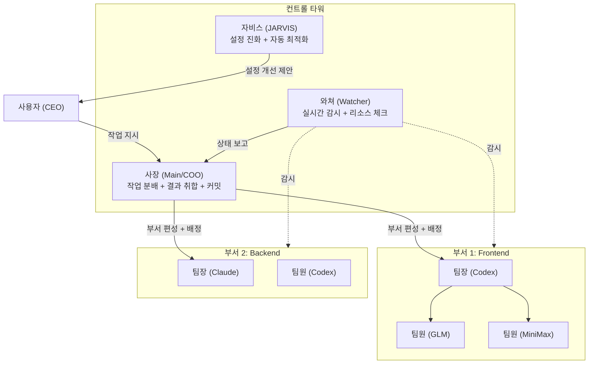
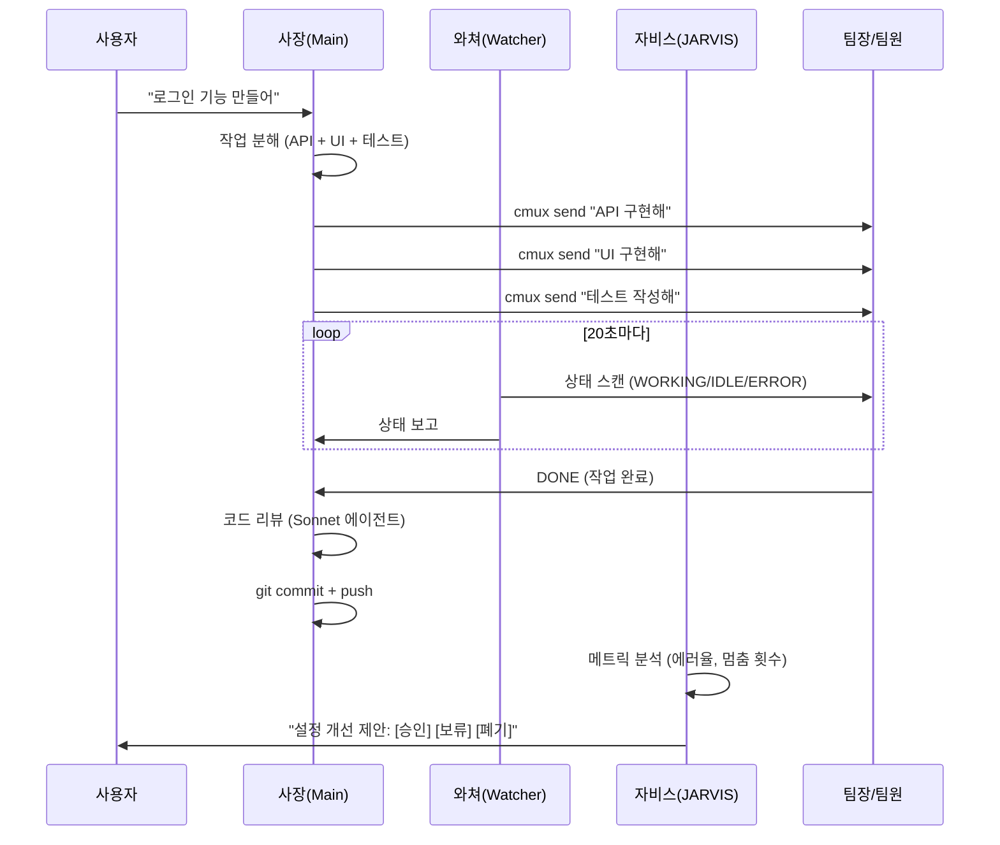
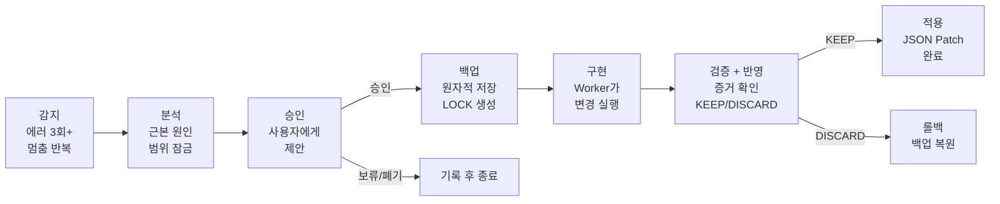

# cmux-orchestrator-watcher-pack

**AI 다중 자동 협업 플랫폼** — 한 명의 지시로 여러 AI가 동시에 일하고, 감시하고, 스스로 개선합니다.

`9 Skills` `27 Hooks` `6+ AI Models` `One-Command Start`

---

## 이게 뭔가요?

Claude Code를 하나만 쓰면 **한 번에 하나의 작업**만 가능합니다. 파일 10개를 수정해야 하면 순서대로 하나씩.

이 시스템은 **여러 AI를 동시에 부려서** 병렬로 작업합니다. 사용자(CEO)가 "로그인 기능 만들어"라고 하면:

1. **사장(Main)** 이 작업을 쪼개서 팀을 편성합니다
2. **팀장/팀원** 들이 각자 맡은 부분을 동시에 코딩합니다
3. **와쳐(Watcher)** 가 멈춤/에러를 실시간 감시합니다
4. **자비스(JARVIS)** 가 반복 문제를 감지하여 설정을 자동 개선합니다

```
기존: 사용자 → Claude 1개 → 순차 작업 (50분)
이것: 사용자 → 사장 → 팀장 3명 → 병렬 작업 (17분) + 자동 감시 + 자동 최적화
```

---

## 왜 필요한가?

|  | Claude Code 단독 | 수동 tmux 멀티세션 | **이 시스템** |
|--|-----------------|-------------------|-------------|
| **시작** | 즉시 | 5-10분 (수동 pane 생성) | **1초** (`/cmux-start`) |
| **병렬 작업** | 불가 (1개 세션) | 가능하지만 수동 관리 | **자동 분배 + 추적** |
| **에러 감지** | 사용자가 직접 확인 | 수동 화면 체크 | **4계층 자동 감시** |
| **멈춤 복구** | 수동 재시작 | 수동 재시작 | **3회 반복 → 자동 설정 개선** |
| **설정 최적화** | 시행착오 | 불가능 | **JARVIS가 분석 → 제안 → 적용** |
| **롤백** | 없음 | 없음 | **원자적 백업 + 즉시 복원** |
| **컨텍스트 보존** | `/clear` 시 유실 | pane 전환 시 유실 | **자동 보존 + 재주입** |

---

## 아키텍처



**3계층 구조:**

| 계층 | 구성 | 역할 |
|------|------|------|
| **컨트롤 타워** | 사장 + 와쳐 + 자비스 | 지휘, 감시, 최적화 |
| **부서 (Department)** | 팀장 + 팀원 N명 | 실제 코딩 작업 |
| **워커 (Worker)** | 개별 AI 세션 | 단위 태스크 수행 |

---

## 워크플로우



---

## 실전 예시: "로그인 기능 추가"

### 기존 방식 (순차, 50분)

```
00:00  Claude에 "API 설계" 지시          → 15분
00:15  Claude에 "인증 모듈 구현" 지시     → 20분
00:35  Claude에 "테스트 작성" 지시        → 10분
00:45  직접 리뷰 + 커밋                   →  5분
───────────────────────────────────────
총 50분 (순차, 1개 AI)
```

### 이 시스템 (병렬, 17분)

```
00:00  /cmux-start (컨트롤 타워 생성)     →  3초
00:01  "로그인 기능 만들어"
       사장이 자동으로:
       ├─ Codex에 "API 설계"      ─┐
       ├─ GLM에 "인증 모듈 구현"   ─┼─ 동시 진행 (12분)
       └─ MiniMax에 "테스트 작성"  ─┘
00:13  와쳐: "3개 surface DONE 확인"
00:14  사장: 코드 리뷰 (Sonnet)           →  2분
00:16  사장: git commit + push            →  1분
───────────────────────────────────────
총 17분 (병렬, 3개 AI) = 66% 시간 절약
```

---

## 9개 스킬

| 슬래시 커맨드 | 이름 | 역할 | 실행 위치 |
|--------------|------|------|----------|
| `/cmux-start` | 시작 | 컨트롤 타워 생성 + 기존 세션 포함 질문 | 아무 세션 |
| `/cmux-stop` | 종료 | 부서 선택적 닫기 + 상태 정리 | Main |
| `/cmux-orchestrator` | 사장 | 부서 편성 + 작업 분배 + 결과 취합 | Main |
| `/cmux-watcher` | 와쳐 | 실시간 감시 + 에러/멈춤 감지 | Watcher |
| `/cmux-config` | 설정 | AI 프로파일 관리 (감지/추가/제거) | 아무 세션 |
| `/cmux-help` | 도움말 | 명령어 레퍼런스 | 아무 세션 |
| `/cmux-pause` | 정지 | 긴급 정지 + 재개 | Main |
| `/cmux-uninstall` | 제거 | 완전 제거 + 백업 롤백 | 아무 세션 |
| `cmux-jarvis` | 자비스 | 설정 진화 엔진 (자동 감지 + 최적화) | JARVIS |

---

## JARVIS 진화 엔진

반복되는 문제를 감지하고 설정을 자동 개선합니다.



### Iron Laws (불변 법칙)

| # | 법칙 | 의미 |
|---|------|------|
| 1 | **사용자 승인 없이 진화 없음** | 모든 설정 변경은 사용자가 [승인]해야 실행 |
| 2 | **예상 결과 없이 구현 없음** | 변경 전 "이걸 하면 어떻게 되는지" 문서화 필수 |
| 3 | **검증 증거 없이 완료 없음** | 변경 후 실제로 개선되었는지 증거 확인 필수 |

### 안전 장치

- **연속 진화 제한**: 최대 3회 (무한 루프 방지)
- **일일 진화 제한**: 최대 10회
- **LOCK 파일**: 동시 진화 방지 (TTL 60분)
- **2세대 백업**: 즉시 롤백 가능

---

## 27개 Hook 시스템

모든 hook은 **오케스트레이션 모드에서만** 활성화됩니다. 일반 사용 시 간섭 없음.

| 이벤트 | 개수 | 역할 | 강제 수준 |
|--------|------|------|----------|
| **PreToolUse** | 13 | 도구 실행 전 차단/허용 | L0 (물리적 차단) |
| **PostToolUse** | 4 | 실행 후 모니터링 | L2 (경고) |
| **UserPromptSubmit** | 3 | 프롬프트 전 컨텍스트 주입 | L2 |
| **SessionStart** | 3 | 세션 시작 시 설정 로드 | L1 |
| **FileChanged** | 1 | 파일 변경 즉시 감지 (JARVIS) | 트리거 |
| **ConfigChange** | 1 | settings.json 보호 (JARVIS) | L0 |
| **PreCompact / PostCompact** | 2 | 컨텍스트 보존 (JARVIS) | 정보 |

### 4티어 강제 체계

| 티어 | 메커니즘 | 예시 |
|------|---------|------|
| **L0: 물리적 차단** | PreToolUse hook이 도구 실행 자체를 막음 | 미검증 상태에서 git commit 차단 |
| **L1: 자동 실행** | cmux 이벤트 후 자동 스크립트 | send-key 후 eagle 상태 자동 갱신 |
| **L2: 경고 에스컬레이션** | systemMessage로 경고 주입 | IDLE surface 3개+ 방치 시 알림 |
| **L3: 자가 점검** | SKILL.md 체크리스트 | 라운드 종료 전 GATE 0-7 확인 |

---

## AI 프로파일

6종 AI를 자동 감지하고 특성에 맞게 배치합니다.

| AI | CLI 명령 | 특성 | 적합한 역할 |
|----|---------|------|-----------|
| **Claude** | `claude` | 범용, 고품질 | 사장(COO), 팀장 |
| **Codex** | `codex` | 빠른 코딩, 샌드박스 | 팀원 (cmux CLI 불가) |
| **OpenCode** | `cco` | 경량, 빠름 | 팀원 |
| **GLM** | `ccg2` | 짧은 프롬프트 전용 | 팀원 (200자 이내) |
| **Gemini** | `gemini` | 2단계 전송 필요 | 팀원 (/clear + 작업 분리) |
| **MiniMax** | `ccm` | 균형, 비용 효율 | 팀원 |

```bash
# AI 자동 감지
/cmux-config detect

# 수동 추가/제거
/cmux-config add codex
/cmux-config remove glm
```

---

## 설치

### 전제 조건

| 요구사항 | 확인 방법 | 비고 |
|---------|----------|------|
| cmux 0.62+ | `cmux --version` | 필수 |
| Claude Code 2.1+ | `claude --version` | 필수 |
| Python 3.9+ | `python3 --version` | 필수 |
| jq | `jq --version` | 선택 (없으면 python3 fallback) |

### 설치 (1분)

```bash
bash install.sh
```

설치 스크립트가 자동으로:
1. cmux, python3 사전 검증
2. 기존 settings.json + skill 백업
3. 9개 skill 복사 + 실행 권한 설정
4. 27개 hook symlink + settings.json 등록
5. AI 프로파일 자동 감지

---

## Quick Start

```bash
# 1. 설치
bash install.sh

# 2. Claude Code에서 시작
/cmux-start
# → 컨트롤 타워 생성 (사장 + 와쳐 + 자비스)

# 3. 작업 지시
"프로젝트에 로그인 기능을 추가해줘"
# → 사장이 자동으로 부서 편성 → 병렬 작업 시작

# 4. 진행 확인 (자동)
# → 와쳐가 실시간 감시, 에러 시 사장에게 보고

# 5. 종료
/cmux-stop
# → [전부 닫기] / [컨트롤 타워만] / [그대로 두기]
```

---

## 보안

| 메커니즘 | 구현 | 보호 대상 |
|---------|------|----------|
| **주입 방지** | `shlex.quote()` 전체 적용, `shell=True` 미사용 | 셸 메타문자 공격 |
| **원자적 백업** | 설치/진화 시 백업 → 복사 (덮어쓰기 금지) | settings.json 손상 |
| **GATE 이중 강제** | SKILL.md 규칙 + PreToolUse hook | 미승인 설정 변경 |
| **ConfigChange 차단** | exit 2로 변경 자체 방지 | GATE hook 삭제 시도 |
| **LOCK 3조건** | LOCK + phase=applying + evidence 동시 충족 | 위조 진화 적용 |
| **컨트롤 타워 보호** | workspace index 0 고정, close 차단 | Main/Watcher 종료 |
| **모드 게이트** | `/cmux-start` 전에는 27개 hook 비활성 | 비오케스트레이션 세션 간섭 |

---

## 프로젝트 구조

```
cmux-orchestrator-watcher-pack/
├── install.sh                    # 원커맨드 설치 스크립트
├── README.md
│
├── cmux-orchestrator/            # 사장(Main) — 지휘 + 분배 + 취합
│   ├── SKILL.md                  # 오케스트레이션 지침
│   ├── hooks/          (19)      # 워크플로우 강제 hook
│   ├── scripts/        (20+)    # eagle_watcher, dispatcher 등
│   ├── references/     (16)     # 아키텍처/패턴 참조 문서
│   └── agents/         (3)      # cmux-reviewer, cmux-git, cmux-security
│
├── cmux-watcher/                 # 와쳐 — 실시간 감시
│   ├── SKILL.md
│   ├── hooks/          (2)
│   ├── scripts/        (4)
│   └── references/     (4)
│
├── cmux-jarvis/                  # 자비스 — 설정 진화 엔진
│   ├── SKILL.md
│   ├── hooks/          (6)       # GATE, FileChanged, Compact 등
│   ├── scripts/        (6)       # evolution, verify, maintenance
│   ├── references/     (7)       # iron-laws, red-flags, metrics 등
│   └── skills/         (2)       # evolution, visualization
│
├── cmux-start/                   # /cmux-start
├── cmux-stop/                    # /cmux-stop
├── cmux-config/                  # /cmux-config
├── cmux-help/                    # /cmux-help
├── cmux-pause/                   # /cmux-pause
├── cmux-uninstall/               # /cmux-uninstall
│
├── docs/
│   └── jarvis/         (20+)    # JARVIS 설계 문서
└── tests/                        # Hook 테스트
```

---

## 문서

| 경로 | 내용 |
|------|------|
| `cmux-orchestrator/references/` | 16개 참조 문서 (아키텍처, 패턴, 게이트, 에러 복구) |
| `cmux-jarvis/references/` | 7개 참조 문서 (Iron Laws, Red Flags, 메트릭) |
| `docs/jarvis/architecture/` | 핵심 원칙, 디렉토리 구조, Phase 로드맵 |
| `docs/jarvis/pipeline/` | 진화 파이프라인, 피드백 루프, Worker 프로토콜 |
| `docs/jarvis/research/` | Claude Code 소스 분석, 20개 레포 조사 |
| `docs/jarvis/simulations/` | STALL/ERROR 시뮬레이션, Iron Law 공격 테스트 |

---

## 제거

```
/cmux-uninstall
# → [백업에서 롤백] 또는 [cmux hook만 제거]
```

---

## License

MIT
