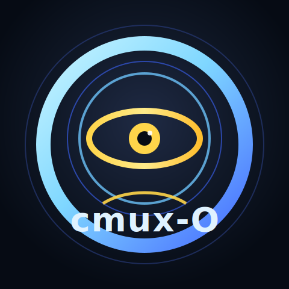
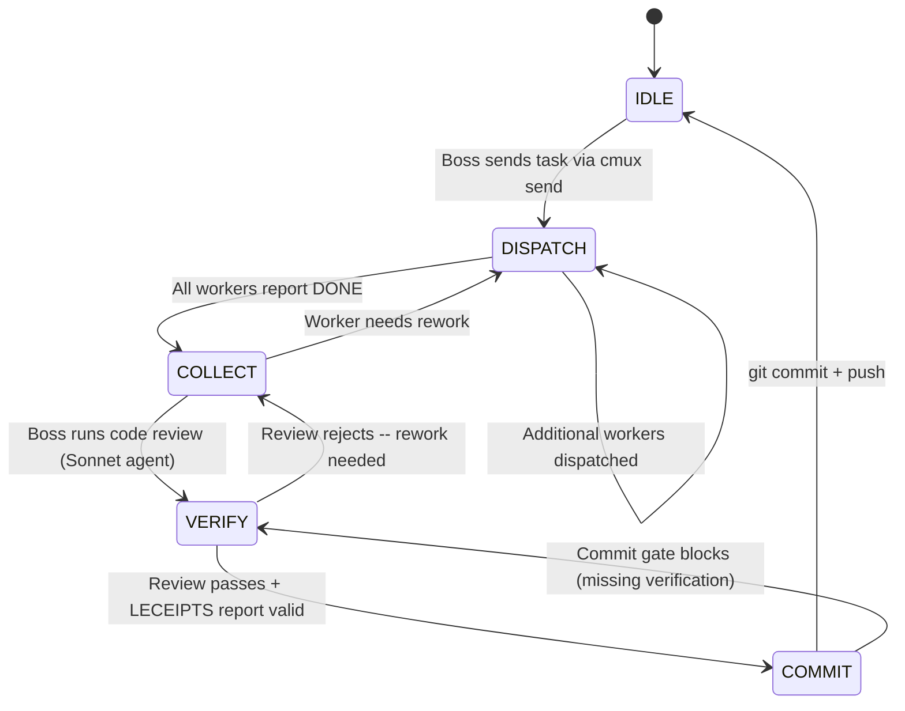

<p align="center">
  
</p>

<h1 align="center">cmux-O</h1>
<p align="center"><strong>cmux Orchestration JARVIS Watcher Pack</strong></p>

<p align="center">
  <strong>cmux-O AI Orchestration Core for Claude Code</strong><br>
  One command. Multiple AIs. Parallel execution. Self-healing.
</p>

<p align="center">
  
  
  
  
  
  
  
  
  
  
</p>

---

## What is this?

Claude Code runs **one task at a time**. Need to modify 10 files? You wait in line.

This system orchestrates **multiple AIs in parallel** through tmux, with real-time monitoring and self-healing configuration.

```
Before:  You --> Claude (1) --> Sequential work .......... 50 min
After:   You --> Boss --> 3 Workers in parallel .... 17 min  (-66%)
                         + Watcher (monitoring)
                         + JARVIS (self-optimization)
```

**How it works:**

| Step | What happens |
|------|-------------|
| `/cmux-start` | Control tower spins up in 3 seconds (Boss + Watcher + JARVIS) |
| You say the task | Boss decomposes work and dispatches to workers in parallel |
| Workers code | Each AI works independently on its own tmux pane |
| Watcher monitors | 4-layer scan detects IDLE/ERROR/STALL every 20 seconds |
| Boss collects | Results gathered, code reviewed (Sonnet agent), committed |
| JARVIS evolves | Repeated failures trigger automatic config improvements |

---

## Architecture

### System Overview


### Three-Layer Hierarchy

| Layer | Components | Responsibility | Communication |
|-------|-----------|---------------|---------------|
| **CEO Staff** | JARVIS | Direct user liaison. Analyzes metrics, proposes config evolution, propagates policy to all layers | Bidirectional with User. Push to Boss/Watcher |
| **Control Tower** | Boss + Watcher | Boss: task decomposition, dispatch, collection, code review, commit. Watcher: continuous surveillance | Boss <-> Watcher via status reports. Boss -> Departments via `cmux send` |
| **Departments** | Lead + N Workers | Lead autonomously manages workers, selects models by difficulty. Workers execute independently in isolated tmux panes | Lead -> Workers via sub-task dispatch. Results bubble up to Boss |

### Workflow State Machine

Every orchestration round follows a strict state machine enforced by `cmux-workflow-state-machine.py`:



### Data Flow & Communication

```
+------------------+     cmux send      +-------------------+
|                  | -----------------> |                   |
|      Boss        |                    |  Worker tmux pane |
|                  | <----------------- |                   |
+--------+---------+   capture-pane     +-------------------+
         |                                      ^
         | status report                        | Eagle scan
         |                                      | OCR capture
+--------+---------+                            | VisionDiff
|                  | ----- 4-layer scan --------+
|     Watcher      |
|                  | --- staleness check (180s) ---> auto-restart
+--------+---------+
         |
         | (if 3+ repeated failures)
         v
+------------------+     propose      +--------+
|                  | --------------> |        |
|     JARVIS       |                 |  User  |
|                  | <-------------- |        |
+------------------+  approve/reject +--------+
         |
         | (on approve)
         v
    Backup --> Implement --> Verify --> Apply or Rollback
```

### Hook Enforcement Layer

Hooks form an invisible governance layer that physically prevents protocol violations:

```
  Tool Call (e.g. git commit)
       |
       v
  +--------------------------+
  | PreToolUse Hook Chain    |
  |                          |
  |  LECEIPTS gate ----+     |    Block: no 5-section report
  |  Completion gate --+     |    Block: uncollected results
  |  Workflow SM ------+---> |    Block: wrong state
  |  Plan QG ----------+     |    Block: no verification
  |  CT guard ---------+     |    Block: closing control tower
  |                          |
  +--------------------------+
       |
       | All gates pass
       v
  Tool executes normally
```

> **Key design principle:** All 31 hooks are **dormant** until `/cmux-start` activates orchestration mode (`/tmp/cmux-orch-enabled`). In normal Claude Code usage, zero interference.

---

## Quick Start

```bash
# Install (1 minute)
bash install.sh

# Start orchestration
/cmux-start

# Give a task
"Add login functionality to the project"
# --> Boss auto-decomposes --> Workers execute in parallel

# Operations
/cmux-pause            # Emergency stop (all AIs freeze)
/cmux-pause resume     # Resume
/cmux-watcher-mute     # Toggle watcher notifications

# Shutdown
/cmux-stop
```

---

## 9 Skills

| Command | Name | What it does |
|---------|------|-------------|
| `/cmux-start` | Start | Spin up control tower + detect existing sessions |
| `/cmux-stop` | Stop | Selective shutdown (departments / control tower / all) |
| `/cmux-orchestrator` | Boss | Decompose + dispatch + collect + commit |
| `/cmux-watcher` | Watcher | 4-layer monitoring + error/stall detection |
| `/cmux-config` | Config | AI profile management (detect / add / remove) |
| `/cmux-help` | Help | Command reference |
| `/cmux-pause` | Pause | Emergency freeze + resume |
| `/cmux-uninstall` | Uninstall | Full removal + backup rollback |
| `cmux-jarvis` | JARVIS | Self-evolving config engine (auto-invoked) |

---

## Watcher: 4-Layer Monitoring

The Watcher is a **dedicated monitoring AI** that runs continuously in its own tmux pane.

| Layer | Method | Detects |
|-------|--------|---------|
| **L1 Eagle** | Text-based status parsing | IDLE / WORKING / ERROR / DONE |
| **L2 OCR** | Apple Vision screen capture | Stuck states, error dialogs |
| **L2.5 VisionDiff** | Before/after screen comparison | No screen change (stall) |
| **L3 Pipe-pane** | Raw tmux output capture | Rate limits, context overflow |

**Key behaviors:**
- IDLE debounce: 30s grace after DONE + 120s min between reminders
- Mute mode: notifications off, scanning continues
- Pause sync: auto-freezes with `/cmux-pause`, checks every 5s
- Role filtering: only monitors workers (Boss/Watcher/JARVIS excluded)

---

## JARVIS: Self-Evolving Config Engine

When the same problem repeats 3+ times, JARVIS detects it and proposes a config fix.

```
Detect --> Analyze --> Propose --> [User Approves] --> Backup --> Implement --> Verify
                                  [User Rejects]  --> Log & Close
```

### Iron Laws

| # | Law | Meaning |
|---|-----|---------|
| 1 | **No evolution without user approval** | Every config change requires explicit `[Approve]` |
| 2 | **No implementation without expected outcome** | Document what will change before doing it |
| 3 | **No completion without verification evidence** | Prove the fix actually worked |

### Safety Rails

- Max 3 consecutive evolutions (loop prevention)
- Max 10 daily evolutions
- LOCK file prevents concurrent evolution (TTL 60min)
- 2-generation backup for instant rollback

---

## 31 Hooks: 4-Tier Enforcement

All hooks are **dormant until `/cmux-start`**. Zero interference in normal usage.

### By Event

| Event | Count | Purpose | Enforcement |
|-------|-------|---------|-------------|
| **PreToolUse** | 15 | Block tool execution before it runs | L0 Physical Block |
| **PostToolUse** | 4 | Monitor after execution | L2 Warning |
| **UserPromptSubmit** | 3 | Inject context before prompt | L2 |
| **SessionStart** | 3 | Load config at session init | L1 |
| **Stop** | 1 | Cleanup on session end | L1 |
| **FileChanged** | 1 | Detect file changes (JARVIS) | Trigger |
| **ConfigChange** | 1 | Protect settings.json (JARVIS) | L0 |
| **Pre/PostCompact** | 2 | Context preservation (JARVIS) | Info |

### Enforcement Tiers

| Tier | Mechanism | Example |
|------|-----------|---------|
| **L0: Physical Block** | PreToolUse hook prevents tool execution | Unverified `git commit` blocked |
| **L1: Auto-execute** | Script runs automatically on event | Eagle status refresh after send-key |
| **L2: Warning Escalation** | systemMessage injects warning | 3+ IDLE surfaces trigger alert |
| **L3: Self-check** | SKILL.md checklist | GATE 0-7 before round end |

### Gate Matrix (L0 Blocks)

| Gate | Rule | Hook |
|------|------|------|
| GATE 0 | No commit before collection complete | `cmux-completion-verifier.py` |
| GATE 6 | IDLE surface exists -> Agent forbidden | `cmux-gate6-agent-block.sh` |
| GATE 7 | IDLE worker exists -> Boss direct work forbidden | `cmux-gate7-main-delegate.py` |
| CT | Control tower close forbidden | `cmux-control-tower-guard.py` |
| LECEIPTS | 5-section report before commit | `cmux-leceipts-gate.py` |
| PLAN-QG | 5-point verification + simulation before ExitPlanMode | `cmux-plan-quality-gate.py` |
| WF | Workflow state machine (DISPATCH->COLLECT->VERIFY->COMMIT) | `cmux-workflow-state-machine.py` |

---

## AI Profiles

6 AI models auto-detected and assigned by capability.

| AI | CLI | Strength | Best Role |
|----|-----|----------|-----------|
| **Claude** | `claude` | General-purpose, high quality | Boss, Lead |
| **Codex** | `codex` | Fast coding, sandboxed | Worker (no cmux CLI) |
| **OpenCode** | `cco` | Lightweight, fast | Worker |
| **GLM** | `ccg2` | Short prompt specialist | Worker (< 200 chars) |
| **Gemini** | `gemini` | 2-step delivery | Worker (/clear + task split) |
| **MiniMax** | `ccm` | Balanced, cost-efficient | Worker |

```bash
/cmux-config detect     # Auto-detect installed AIs
/cmux-config add codex   # Manual add
/cmux-config remove glm  # Manual remove
```

---

## Cross-Platform

Runs on macOS, Windows, Linux, and WSL.

- Terminal binary routing is OS-aware by default: `cmux` on macOS/Linux, `cmuxw` on Windows.
- macOS binary source: [`manaflow-ai/cmux`](https://github.com/manaflow-ai/cmux)
- Windows binary source: [`scokeepa/cmuxw`](https://github.com/scokeepa/cmuxw)
- You can force an explicit binary with `CMUX_BIN=/path/to/cmux-or-cmuxw`.
- OS-specific shell differences are abstracted through `cmux_compat` — a Python daemon that normalizes `grep -P`, `date -j`, `stat -f`, and other OS-dependent operations into a single API.

- Auto-starts with `/cmux-start` via Unix socket (`/tmp/cmux-compat.sock`)
- Falls back to inline `python3` if daemon is unavailable

---

## Security

| Mechanism | Implementation | Protects Against |
|-----------|---------------|-----------------|
| Injection prevention | `shlex.quote()` everywhere, no `shell=True` | Shell metachar attacks |
| Atomic backups | Backup-then-copy (never overwrite) | settings.json corruption |
| Dual enforcement | SKILL.md rules + PreToolUse hooks | Unauthorized config changes |
| ConfigChange block | `exit 2` prevents modification | GATE hook deletion |
| LOCK 3-conditions | LOCK + phase=applying + evidence | Forged evolution attempts |
| Control tower guard | shlex token analysis for `close-workspace` only | Boss/Watcher termination |
| Role filtering | `cmux identify` + roles.json | Cross-session interference |
| Mode gate | All 31 hooks dormant before `/cmux-start` | Non-orchestration interference |
| Palace chmod 0o700 | Owner-only directory permissions | Unauthorized palace access |
| Input sanitize | `sanitize_name()` blocks path traversal, null bytes | Metadata injection |
| ONNX CoreML guard | `ORT_DISABLE_COREML=1` on Apple Silicon | arm64 vector query segfault |
| Mentor opt-out | `config.json` `mentor.enabled: false` | Signal/context/report all gated |
| Nudge authority | `cmux-roles.json` workspace validation | Cross-workspace nudge blocked |
| Restore safety | SQL direct extraction (migrate.py pattern) | ChromaDB 0.6.x disk I/O error |

---

## JARVIS Mentor Lane: AI Collaboration Harness Improvement

Beyond self-evolving config, JARVIS now includes a **Mentor Lane** powered by **mempalace ChromaDB** that observes your instruction quality, provides non-blocking coaching hints, and enables **semantic search** across all mentor signals.

### 6-Axis Skill Dimensions

Measures AI collaboration effectiveness across 6 independent axes (adapted from vibe-sunsang):

```
  DECOMP  ████████░░  Task decomposition clarity
  VERIFY  █████░░░░░  Verification & testing habits
  ORCH    █████████░  Orchestration strategy selection
  FAIL    ██████░░░░  Failure analysis & recovery
  CTX     ████████░░  Context provision (paths, constraints)
  META    ████░░░░░░  Self-reflection on instruction quality
```

### Harness Level System

| Level | Stage | What it means |
|-------|-------|---------------|
| L1~L2 | Manual/Proactive | Basic requests, starting to provide context |
| L3~L4 | Transition/Lead | File-level specificity, verification required |
| L5~L6 | Design/Integration | Strategic tool combination, multi-agent experience |
| L7 | Expansion | Community contribution, external impact |

### Mentor Architecture

```
  User Instruction
       |
       v
  Signal Engine ──> ChromaDB palace (6-axis scores + antipatterns)
       |
       +──> L0/L1 Context (600-900 tokens) ──> /cmux prompt injection
       |
       +──> Coaching Hint (max 1/round, spam-protected)
       |
       +──> Weekly Report (palace longitudinal tracking)
       |
       v
  Failure Classifier
       |
       +──> System config issue ──> Evolution Lane (Iron Law #1 approval)
       +──> User instruction issue ──> Mentor Lane (soft coaching)
       +──> Mixed ──> Compare proposal to User/CEO
```

### Privacy by Design

| Default | Description |
|---------|-------------|
| Raw capture **OFF** | Only derived signals stored; raw conversation opt-in only |
| Auto-redaction | API keys, passwords, tokens stripped before storage |
| 90-day retention | Signals pruned after 90 days via ChromaDB delete |
| Local-only | No network transmission; all data in `~/.cmux-jarvis-palace/` |
| Semantic search | ChromaDB + all-MiniLM-L6-v2 embedding (ONNX, local) |

### Nudge/Escalation (L1 Implemented)

When workers stall, the system can send role-appropriate nudges:

| Target | Issuer | Level | Mechanism |
|--------|--------|-------|-----------|
| Worker | Team Lead | L1 | Non-blocking text reminder via `cmux send` |
| Team Lead | Boss | L1 | Status request with evidence |
| Boss | JARVIS (User approval) | L1 | Evidence bundle + recommendation |
| Watcher | - | - | Evidence producer only, cannot execute nudges |

Cooldown: 5 min per target. Cross-workspace nudge blocked (team_lead). All nudges logged to ChromaDB `cmux_nudge` wing. Send failure detected via returncode check (outcome: sent/failed).

---

## Performance Indicators

### Orchestration Efficiency

```
Sequential (1 AI):  ========================== 50 min
Parallel (3 AIs):   ========= 17 min  (-66%)
With monitoring:    ========== 18 min  (1 min overhead for 4-layer scan)
```

### System Metrics

| Metric | Value | Description |
|--------|-------|-------------|
| Control tower boot | ~3 sec | `/cmux-start` to Boss+Watcher+JARVIS ready |
| Watcher scan cycle | 20 sec | 4-layer (Eagle+OCR+VisionDiff+Pipe-pane) |
| DONE re-verification | 30 sec | Mandatory recheck before confirming completion |
| Hook overhead | <50 ms | Per PreToolUse gate check |
| Context injection | <100 ms | L0/L1 mentor context + coaching hint |
| Nudge cooldown | 300 sec | Per-target rate limit |

### Test Coverage

```
  test_cmux_utils        ████████████████  9 tests   Core utilities
  test_hooks             ██████████        6 tests   Hook enforcement
  test_mentor_signal     ██████████████    7 tests   6-axis signal + mentor.enabled gate
  test_palace_memory     ████████████████████████ 13 tests  Palace memory + restore + version detect
  test_redaction         ████████████████  8 tests   Privacy redaction + sanitize
  test_context_injection ██████████        5 tests   Prompt injection logic
  test_nudge             ████████████████████████ 18 tests  Nudge L1 + cooldown + authority + redaction
  test_mentor_report     ████████████      6 tests   Report generation
  test_failure_class.    ██████████████    7 tests   Failure classification
  test_watcher_scan      ████████          4 tests   Watcher regression (path/timeout/pipe-pane)
  ─────────────────────────────────────────────────
  Total                                   83 tests  ALL PASSED
```

### Codebase Scale

| Component | Files | Lines | Purpose |
|-----------|-------|-------|---------|
| cmux-O Orchestrator Core | 82 | ~8K | Boss orchestration, hooks, dispatch |
| cmux-O Watcher Engine | 12 | ~3K | 4-layer monitoring engine |
| cmux-O JARVIS Core | 35 | ~6K | Evolution + Mentor + ChromaDB Memory |
| Mentor scripts | 6 | ~1,300 | Signal, Memory, Redactor, Nudge, Report, Classifier |
| Architecture docs | 22 | ~2,000 | System + JARVIS + operations + dev |
| Tests | 11 | ~1,350 | 83 unit tests (ChromaDB-based) |

---

## Installation

### Prerequisites

| Requirement | Check | Note |
|-------------|-------|------|
| cmux 0.62+ | `cmux --version` | Required |
| Claude Code 2.1+ | `claude --version` | Required |
| Python 3.9+ | `python3 --version` | Required |
| chromadb | `pip3 install chromadb` | Required (Mentor Lane) |
| mempalace | `pip3 install mempalace` | Optional (advanced palace features) |

### Install

```bash
bash install.sh
```

The installer automatically:
1. Detects OS (macOS / Linux / WSL)
2. Validates cmux and python3 versions
3. Installs chromadb (Mentor Lane memory engine)
4. Backs up existing settings.json and skills
5. Copies 9 skills to `~/.claude/skills/`
6. Creates 31 hook symlinks + registers in settings.json
7. Auto-detects installed AI CLIs

### Uninstall

```bash
/cmux-uninstall
# --> [Rollback from backup] or [Remove cmux hooks only]
```

---

## Project Structure

```
cmux-O/                                  216 files
|
|-- install.sh                             One-command installer
|-- README.md
|
|-- cmux-orchestrator/                     cmux-O Boss Core (orchestration)
|   |-- SKILL.md                           Orchestration directives
|   |-- activation-hook.sh                 Auto-registration on skill load
|   |-- hooks/                (22)         Workflow enforcement hooks
|   |-- scripts/              (37)         eagle, dispatcher, compat, validators
|   |-- references/           (16)         Architecture + gate docs
|   |-- agents/               (3)          cmux-reviewer, cmux-git, cmux-security
|   |-- commands/             (2)          Command definitions
|   +-- config/               (2)          ai-profile.json, orchestra-config.json
|
|-- cmux-watcher/                          cmux-O Watcher Engine (real-time monitoring)
|   |-- SKILL.md
|   |-- hooks/                (2)
|   |-- scripts/              (4)          watcher-scan.py (55KB, unified scanner)
|   |-- commands/             (2)          cmux-watcher-mute
|   +-- references/           (4)          Monitoring protocols
|
|-- cmux-jarvis/                           cmux-O JARVIS Core (evolution + mentor intelligence)
|   |-- SKILL.md
|   |-- hooks/                (6)          GATE, FileChanged, Compact
|   |-- scripts/              (21)         Evolution, verify, mentor signal/memory/
|   |   |                                  report/nudge/classifier/redactor
|   |-- references/           (7)          Iron laws, red flags, metrics
|   |-- agents/               (1)          evolution-worker
|   +-- skills/               (2)          Evolution, visualization sub-skills
|
|-- cmux-start/                            /cmux-start
|-- cmux-stop/                             /cmux-stop
|-- cmux-config/                           /cmux-config
|-- cmux-help/                             /cmux-help
|-- cmux-pause/                            /cmux-pause
|-- cmux-uninstall/                        /cmux-uninstall
|
|-- docs/                                  Design documents (SSOT/SRP structured)
|   |-- 00-overview.md                     Project docs navigation hub
|   |-- 01-architecture/      (9)          System, orchestrator, watcher, hooks, security
|   |-- 02-jarvis/            (12)         JARVIS evolution + mentor lane
|   |-- 03-operations/        (4)          Quick start, AI profiles, troubleshooting
|   |-- 04-development/       (4)          Phase roadmap, tests, directory structure
|   |-- 05-research/          (3)          Repo survey, Claude source findings
|   |-- 99-archive/           (14)         Deprecated docs preserved
|   +-- CHANGELOG.md                       Full version history
+-- tests/                    (10)         83 unit tests (ChromaDB-based)
```

---

## Referenced Open Source

This project incorporates patterns and techniques from the following open source repositories:

| Repository | License | What we adopted | Where applied |
|-----------|---------|----------------|---------------|
| [milla-jovovich/mempalace](https://github.com/milla-jovovich/mempalace) | MIT | `extract_drawers_from_sqlite()` — raw SQL drawer extraction bypassing ChromaDB API | `jarvis_palace_memory.py` `_extract_drawers_from_sqlite()` |
| | | `detect_chromadb_version()` — SQLite schema inspection for 0.5.x/0.6.x/1.x | `jarvis_palace_memory.py` `_detect_chromadb_version()` |
| | | Temp palace + `shutil.move` swap pattern for safe restore | `jarvis_palace_memory.py` `cmd_restore()` |
| | | `ORT_DISABLE_COREML=1` + CPU-only test collection helper on Apple Silicon (ONNX CoreML segfault fix) | All 5 mentor scripts + `tests/conftest.py` + `tests/chromadb_test_utils.py` |
| | | Posthog telemetry logger suppression (`logging.CRITICAL`) | All 5 mentor scripts + `tests/conftest.py` |
| | | Module-level HOME isolation in test conftest | `tests/conftest.py` env setup pattern |
| | | Palace directory `chmod 0o700` | `jarvis_palace_memory.py` `_get_collection()` |
| | | Input sanitization (`sanitize_name`, `sanitize_content`) | `mentor_redactor.py` |
| | | Wing/room metadata structure for ChromaDB collections | Palace memory wing architecture |
| [scokeepa/mempalace](https://github.com/scokeepa/mempalace) (feat/backup-export-import-v2) | MIT | Export/import JSON format with dedup + version validation | `jarvis_palace_memory.py` `cmd_export()` / `cmd_import()` |
| | | `_validate_backup()` SQLite `PRAGMA integrity_check` pattern | `jarvis_palace_memory.py` `cmd_backup()` |
| | | Timestamped backup + retention policy | `jarvis_palace_memory.py` `cmd_backup()` |
| [fivetaku/vibe-sunsang](https://github.com/fivetaku/vibe-sunsang) | No license | 6축 스킬 모델 (DECOMP/VERIFY/ORCH/FAIL/CTX/META) — growth-analyst.md 원본 | `jarvis_mentor_signal.py` 6-axis scoring engine |
| | | Harness Level 체계 (L1~L7) + Fit Score 가중평균 공식 | `jarvis_mentor_signal.py` `compute_fit_score()`, `compute_harness_level()` |
| | | Antipattern 탐지 카탈로그 (fix_me_syndrome, context_skip, verification_skip 등) | `jarvis_mentor_signal.py` `detect_antipatterns()` |
| | | Gate 조건 (L3~L7 승급 기준) | `jarvis_mentor_report.py` `GATE_CONDITIONS` |
| | | Coaching hint 생성 패턴 (antipattern → 1-line 코칭) | `jarvis_mentor_signal.py` `generate_coaching_hint()` |
| | | Weekly growth report 구조 (6축 테이블 + 트렌드 + 안티패턴 요약) | `jarvis_mentor_report.py` `generate_report()` |
| [GitFrog1111/badclaude](https://github.com/GitFrog1111/badclaude) | No license | Interrupt + follow-up prompt 패턴 → session-scoped nudge 정책으로 재해석 | `jarvis_nudge.py` L1 nudge system |
| | | "채찍질" 컨셉 — 메모리가 아닌 행동 교정 도구로 역할 분리 | `jarvis_nudge.py` (memory ≠ nudge 경계) |
| | | Cooldown/throttle 패턴 (반복 자극 방지) | `jarvis_nudge.py` `COOLDOWN_SECONDS`, `_check_cooldown()` |
| | | Audit trail (재촉 기록 보존) | `jarvis_nudge.py` `_store_nudge_audit()` → ChromaDB cmux_nudge wing |

> **Note:** `vibe-sunsang`과 `badclaude`는 라이선스가 명시되어 있지 않습니다. 코드를 직접 복사하지 않고, 개념/패턴/구조를 참조하여 독자적으로 재구현했습니다.

---

## Changelog

See [docs/CHANGELOG.md](docs/CHANGELOG.md) for full version history.

---

## License

MIT
