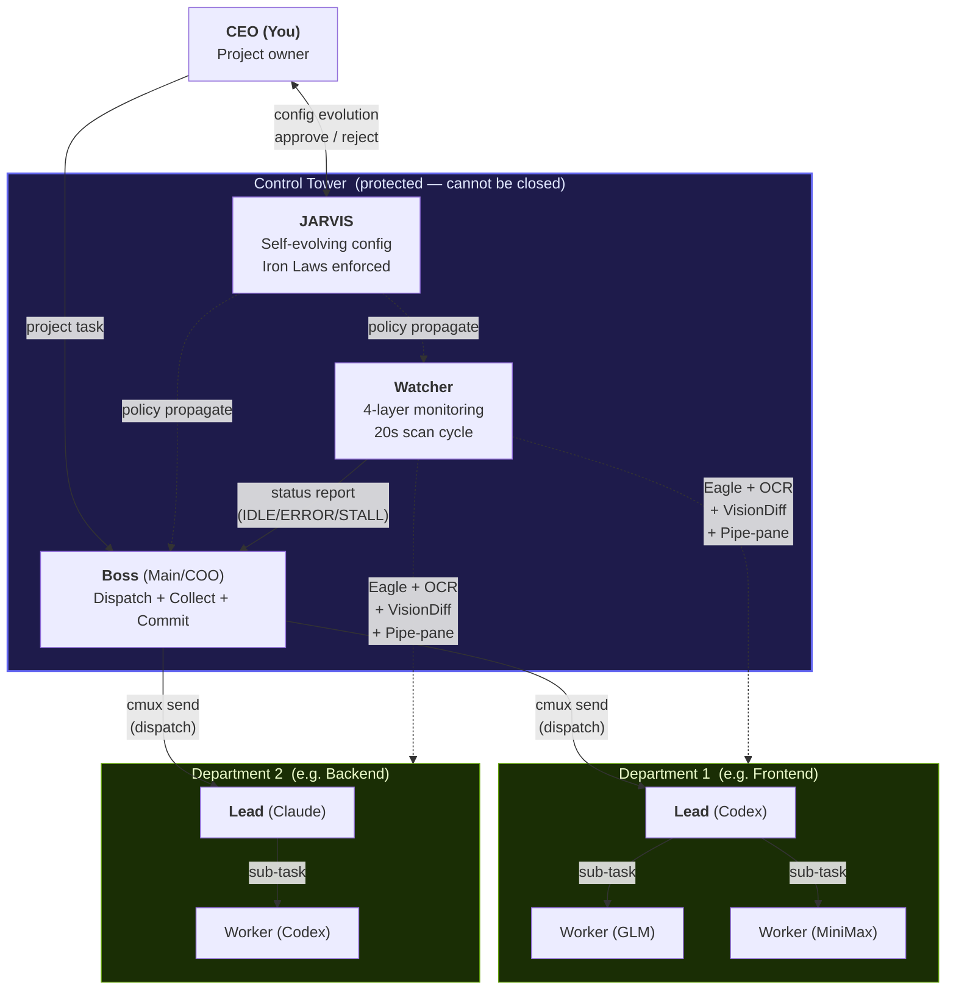
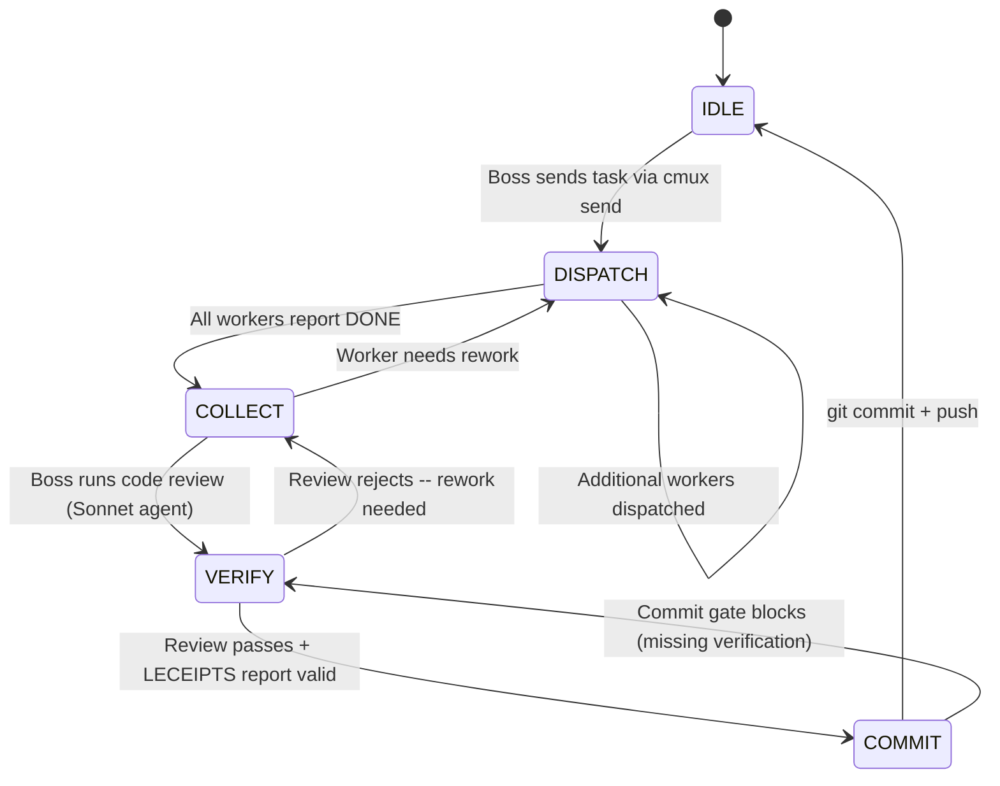

<p align="center">
  <picture>
    <source media="(prefers-color-scheme: dark)" srcset="https://img.shields.io/badge/cmux-orchestrator-4f46e5?style=for-the-badge&logo=data:image/svg+xml;base64,PHN2ZyB4bWxucz0iaHR0cDovL3d3dy53My5vcmcvMjAwMC9zdmciIHdpZHRoPSIyNCIgaGVpZ2h0PSIyNCIgdmlld0JveD0iMCAwIDI0IDI0IiBmaWxsPSJub25lIiBzdHJva2U9IndoaXRlIiBzdHJva2Utd2lkdGg9IjIiPjxjaXJjbGUgY3g9IjEyIiBjeT0iMTIiIHI9IjEwIi8+PHBhdGggZD0iTTggMTJoOE0xMiA4djgiLz48L3N2Zz4=">
    
  </picture>
</p>

<h1 align="center">cmux orchestrator + watcher pack</h1>

<p align="center">
  <strong>AI Multi-Agent Orchestration Platform for Claude Code</strong><br>
  One command. Multiple AIs. Parallel execution. Self-healing.
</p>

<p align="center">
  
  
  
  
  
</p>

---

## What is this?

Claude Code runs **one task at a time**. Need to modify 10 files? You wait in line.

This system orchestrates **multiple AIs in parallel** through tmux, with real-time monitoring and self-healing configuration.

```
Before:  You --> Claude (1) --> Sequential work .......... 50 min
After:   You --> Boss --> 3 Workers in parallel .... 17 min  (-66%)
                         + Watcher (monitoring)
                         + JARVIS (self-optimization)
```

**How it works:**

| Step | What happens |
|------|-------------|
| `/cmux-start` | Control tower spins up in 3 seconds (Boss + Watcher + JARVIS) |
| You say the task | Boss decomposes work and dispatches to workers in parallel |
| Workers code | Each AI works independently on its own tmux pane |
| Watcher monitors | 4-layer scan detects IDLE/ERROR/STALL every 20 seconds |
| Boss collects | Results gathered, code reviewed (Sonnet agent), committed |
| JARVIS evolves | Repeated failures trigger automatic config improvements |

---

## Architecture

### System Overview



### Three-Layer Hierarchy

| Layer | Components | Responsibility | Communication |
|-------|-----------|---------------|---------------|
| **CEO Staff** | JARVIS | Direct user liaison. Analyzes metrics, proposes config evolution, propagates policy to all layers | Bidirectional with User. Push to Boss/Watcher |
| **Control Tower** | Boss + Watcher | Boss: task decomposition, dispatch, collection, code review, commit. Watcher: continuous surveillance | Boss <-> Watcher via status reports. Boss -> Departments via `cmux send` |
| **Departments** | Lead + N Workers | Lead autonomously manages workers, selects models by difficulty. Workers execute independently in isolated tmux panes | Lead -> Workers via sub-task dispatch. Results bubble up to Boss |

### Workflow State Machine

Every orchestration round follows a strict state machine enforced by `cmux-workflow-state-machine.py`:



### Data Flow & Communication

```
+------------------+     cmux send      +-------------------+
|                  | -----------------> |                   |
|   Boss (Main)    |                    |  Worker tmux pane |
|                  | <----------------- |                   |
+--------+---------+   capture-pane     +-------------------+
         |                                      ^
         | status report                        | Eagle scan
         |                                      | OCR capture
+--------+---------+                            | VisionDiff
|                  | ----- 4-layer scan --------+
|     Watcher      |
|                  | --- staleness check (180s) ---> auto-restart
+--------+---------+
         |
         | (if 3+ repeated failures)
         v
+------------------+     propose      +--------+
|                  | --------------> |        |
|     JARVIS       |                 |  User  |
|                  | <-------------- |        |
+------------------+  approve/reject +--------+
         |
         | (on approve)
         v
    Backup --> Implement --> Verify --> Apply or Rollback
```

### Hook Enforcement Layer

Hooks form an invisible governance layer that physically prevents protocol violations:

```
  Tool Call (e.g. git commit)
       |
       v
  +--------------------------+
  | PreToolUse Hook Chain    |
  |                          |
  |  LECEIPTS gate ----+     |    Block: no 5-section report
  |  Completion gate --+     |    Block: uncollected results
  |  Workflow SM ------+---> |    Block: wrong state
  |  Plan QG ----------+     |    Block: no verification
  |  CT guard ---------+     |    Block: closing control tower
  |                          |
  +--------------------------+
       |
       | All gates pass
       v
  Tool executes normally
```

> **Key design principle:** All 30 hooks are **dormant** until `/cmux-start` activates orchestration mode (`/tmp/cmux-orch-enabled`). In normal Claude Code usage, zero interference.

---

## Quick Start

```bash
# Install (1 minute)
bash install.sh

# Start orchestration
/cmux-start

# Give a task
"Add login functionality to the project"
# --> Boss auto-decomposes --> Workers execute in parallel

# Operations
/cmux-pause            # Emergency stop (all AIs freeze)
/cmux-pause resume     # Resume
/cmux-watcher-mute     # Toggle watcher notifications

# Shutdown
/cmux-stop
```

---

## 9 Skills

| Command | Name | What it does |
|---------|------|-------------|
| `/cmux-start` | Start | Spin up control tower + detect existing sessions |
| `/cmux-stop` | Stop | Selective shutdown (departments / control tower / all) |
| `/cmux-orchestrator` | Boss | Decompose + dispatch + collect + commit |
| `/cmux-watcher` | Watcher | 4-layer monitoring + error/stall detection |
| `/cmux-config` | Config | AI profile management (detect / add / remove) |
| `/cmux-help` | Help | Command reference |
| `/cmux-pause` | Pause | Emergency freeze + resume |
| `/cmux-uninstall` | Uninstall | Full removal + backup rollback |
| `cmux-jarvis` | JARVIS | Self-evolving config engine (auto-invoked) |

---

## Watcher: 4-Layer Monitoring

The Watcher is a **dedicated monitoring AI** that runs continuously in its own tmux pane.

| Layer | Method | Detects |
|-------|--------|---------|
| **L1 Eagle** | Text-based status parsing | IDLE / WORKING / ERROR / DONE |
| **L2 OCR** | Apple Vision screen capture | Stuck states, error dialogs |
| **L2.5 VisionDiff** | Before/after screen comparison | No screen change (stall) |
| **L3 Pipe-pane** | Raw tmux output capture | Rate limits, context overflow |

**Key behaviors:**
- IDLE debounce: 30s grace after DONE + 120s min between reminders
- Mute mode: notifications off, scanning continues
- Pause sync: auto-freezes with `/cmux-pause`, checks every 5s
- Role filtering: only monitors workers (Boss/Watcher/JARVIS excluded)

---

## JARVIS: Self-Evolving Config Engine

When the same problem repeats 3+ times, JARVIS detects it and proposes a config fix.

```
Detect --> Analyze --> Propose --> [User Approves] --> Backup --> Implement --> Verify
                                  [User Rejects]  --> Log & Close
```

### Iron Laws

| # | Law | Meaning |
|---|-----|---------|
| 1 | **No evolution without user approval** | Every config change requires explicit `[Approve]` |
| 2 | **No implementation without expected outcome** | Document what will change before doing it |
| 3 | **No completion without verification evidence** | Prove the fix actually worked |

### Safety Rails

- Max 3 consecutive evolutions (loop prevention)
- Max 10 daily evolutions
- LOCK file prevents concurrent evolution (TTL 60min)
- 2-generation backup for instant rollback

---

## 30 Hooks: 4-Tier Enforcement

All hooks are **dormant until `/cmux-start`**. Zero interference in normal usage.

### By Event

| Event | Count | Purpose | Enforcement |
|-------|-------|---------|-------------|
| **PreToolUse** | 15 | Block tool execution before it runs | L0 Physical Block |
| **PostToolUse** | 4 | Monitor after execution | L2 Warning |
| **UserPromptSubmit** | 3 | Inject context before prompt | L2 |
| **SessionStart** | 3 | Load config at session init | L1 |
| **Stop** | 1 | Cleanup on session end | L1 |
| **FileChanged** | 1 | Detect file changes (JARVIS) | Trigger |
| **ConfigChange** | 1 | Protect settings.json (JARVIS) | L0 |
| **Pre/PostCompact** | 2 | Context preservation (JARVIS) | Info |

### Enforcement Tiers

| Tier | Mechanism | Example |
|------|-----------|---------|
| **L0: Physical Block** | PreToolUse hook prevents tool execution | Unverified `git commit` blocked |
| **L1: Auto-execute** | Script runs automatically on event | Eagle status refresh after send-key |
| **L2: Warning Escalation** | systemMessage injects warning | 3+ IDLE surfaces trigger alert |
| **L3: Self-check** | SKILL.md checklist | GATE 0-7 before round end |

### Gate Matrix (L0 Blocks)

| Gate | Rule | Hook |
|------|------|------|
| GATE 0 | No commit before collection complete | `cmux-completion-verifier.py` |
| GATE 6 | IDLE surface exists -> Agent forbidden | `cmux-gate6-agent-block.sh` |
| GATE 7 | IDLE worker exists -> Main direct work forbidden | `cmux-gate7-main-delegate.py` |
| CT | Control tower close forbidden | `cmux-control-tower-guard.py` |
| LECEIPTS | 5-section report before commit | `cmux-leceipts-gate.py` |
| PLAN-QG | 5-point verification + simulation before ExitPlanMode | `cmux-plan-quality-gate.py` |
| WF | Workflow state machine (DISPATCH->COLLECT->VERIFY->COMMIT) | `cmux-workflow-state-machine.py` |

---

## AI Profiles

6 AI models auto-detected and assigned by capability.

| AI | CLI | Strength | Best Role |
|----|-----|----------|-----------|
| **Claude** | `claude` | General-purpose, high quality | Boss, Lead |
| **Codex** | `codex` | Fast coding, sandboxed | Worker (no cmux CLI) |
| **OpenCode** | `cco` | Lightweight, fast | Worker |
| **GLM** | `ccg2` | Short prompt specialist | Worker (< 200 chars) |
| **Gemini** | `gemini` | 2-step delivery | Worker (/clear + task split) |
| **MiniMax** | `ccm` | Balanced, cost-efficient | Worker |

```bash
/cmux-config detect     # Auto-detect installed AIs
/cmux-config add codex   # Manual add
/cmux-config remove glm  # Manual remove
```

---

## Cross-Platform

Runs on macOS, Linux, and WSL. OS-specific commands are abstracted through `cmux_compat` — a Python daemon that normalizes `grep -P`, `date -j`, `stat -f`, and 7 other OS-dependent operations into a single API.

- Auto-starts with `/cmux-start` via Unix socket (`/tmp/cmux-compat.sock`)
- Falls back to inline `python3` if daemon is unavailable

---

## Security

| Mechanism | Implementation | Protects Against |
|-----------|---------------|-----------------|
| Injection prevention | `shlex.quote()` everywhere, no `shell=True` | Shell metachar attacks |
| Atomic backups | Backup-then-copy (never overwrite) | settings.json corruption |
| Dual enforcement | SKILL.md rules + PreToolUse hooks | Unauthorized config changes |
| ConfigChange block | `exit 2` prevents modification | GATE hook deletion |
| LOCK 3-conditions | LOCK + phase=applying + evidence | Forged evolution attempts |
| Control tower guard | shlex token analysis for `close-workspace` only | Main/Watcher termination |
| Role filtering | `cmux identify` + roles.json | Cross-session interference |
| Mode gate | All 30 hooks dormant before `/cmux-start` | Non-orchestration interference |

---

## Installation

### Prerequisites

| Requirement | Check | Note |
|-------------|-------|------|
| cmux 0.62+ | `cmux --version` | Required |
| Claude Code 2.1+ | `claude --version` | Required |
| Python 3.9+ | `python3 --version` | Required |

### Install

```bash
bash install.sh
```

The installer automatically:
1. Detects OS (macOS / Linux / WSL)
2. Validates cmux and python3 versions
3. Backs up existing settings.json and skills
4. Copies 9 skills to `~/.claude/skills/`
5. Creates 30 hook symlinks + registers in settings.json
6. Auto-detects installed AI CLIs

### Uninstall

```bash
/cmux-uninstall
# --> [Rollback from backup] or [Remove cmux hooks only]
```

---

## Project Structure

```
cmux-orchestrator-watcher-pack/           183 files
|
|-- install.sh                             One-command installer
|-- README.md
|
|-- cmux-orchestrator/                     Boss (Main) -- orchestration core
|   |-- SKILL.md                           Orchestration directives
|   |-- activation-hook.sh                 Auto-registration on skill load
|   |-- hooks/                (22)         Workflow enforcement hooks
|   |-- scripts/              (37)         eagle, dispatcher, compat, validators
|   |-- references/           (16)         Architecture + gate docs
|   |-- agents/               (3)          cmux-reviewer, cmux-git, cmux-security
|   |-- commands/             (2)          Command definitions
|   +-- config/               (2)          ai-profile.json, orchestra-config.json
|
|-- cmux-watcher/                          Watcher -- real-time monitoring
|   |-- SKILL.md
|   |-- hooks/                (2)
|   |-- scripts/              (4)          watcher-scan.py (55KB, unified scanner)
|   |-- commands/             (2)          cmux-watcher-mute
|   +-- references/           (4)          Monitoring protocols
|
|-- cmux-jarvis/                           JARVIS -- self-evolving config engine
|   |-- SKILL.md
|   |-- hooks/                (6)          GATE, FileChanged, Compact
|   |-- scripts/              (19)         Evolution, verify, maintenance, plugins
|   |-- references/           (7)          Iron laws, red flags, metrics
|   |-- agents/               (1)          evolution-worker
|   +-- skills/               (2)          Evolution, visualization sub-skills
|
|-- cmux-start/                            /cmux-start
|-- cmux-stop/                             /cmux-stop
|-- cmux-config/                           /cmux-config
|-- cmux-help/                             /cmux-help
|-- cmux-pause/                            /cmux-pause
|-- cmux-uninstall/                        /cmux-uninstall
|
|-- docs/                                  Design documents
|   |-- jarvis/               (33)         JARVIS architecture + research
|   +-- issues/               (1)          Known issues
+-- tests/                                 Hook tests
```

---

## Changelog

### 2026-04-11

- **Orchestrator SKILL.md rewrite** -- Boss operational directives (empty 11-line shell -> full 200+ line guide)
- **Department = workspace structure** -- Department = sidebar tab (workspace), Team Lead = lead surface (Claude Code), Workers = panes within same workspace created by Team Lead
- **Team Lead Phase 1-2-3 protocol** -- Verify -> Plan -> Execute+Verify before dispatching to workers
- **Plan Quality Gate 3-phase enforcement** -- Hook blocks ExitPlanMode unless: [Verification] 5-point sections with verdicts + [Refinement] judgment recorded + [Simulation] TC results with ALL PASS
- **LECEIPTS rules per role** -- Boss (top principles + scope), Team Lead (full leceipts + 5-section DONE), Worker (simplified), JARVIS (leceipts + Iron Laws priority)
- **Architecture section enhanced** -- State machine diagram, data flow, hook enforcement layer visualization
- **LECEIPTS Gate** -- 5-section report + diff hash binding enforced before every `git commit`
- **`is_git_commit()` hardening** -- Detects `git -C .`, `--work-tree`, `--git-dir` variants
- **`has_success` validation** -- At least one passing verification required (no all-failure reports)
- **Watcher guard reorder** -- Complete no-op when orchestration disabled (role marker included)
- **Standalone installer sync** -- HOOK_MAP aligned with activation-hook.sh

### 2026-04-09

- **GATE 7** -- Main direct work blocked when IDLE workers exist
- **JARVIS Python migration** -- Core scripts migrated to Python

### 2026-04-08

- **DONE quality gate** -- Shell-only completion reports blocked
- **Auto-restart protocol** -- Automatic recovery after Claude Code limit reset

### 2026-04-07

- **JARVIS real-time feedback pipeline**
- **Team lead work protocol** (3-phase: analyze, decide, execute)

---

## License

MIT
