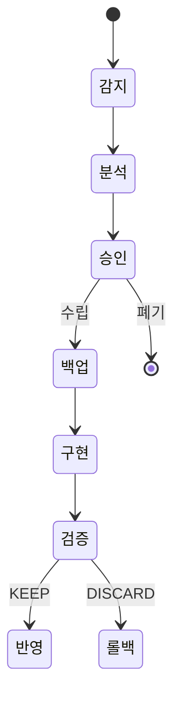

# 진화 보고서 시각화

## Before/After 보고서 형식 (한국어)

```
═══════════════════════════════════════
JARVIS 진화 보고서: evo-{N}
═══════════════════════════════════════
■ 변경: {변경 내용 1줄 요약}

■ Before/After
┌──────────┬──────────┬──────────────┐
│ 메트릭    │ Before   │ After (예상)  │
├──────────┼──────────┼──────────────┤
│ {metric} │ {value}  │ {expected}   │
└──────────┴──────────┴──────────────┘

■ 범위: {Scope Lock bounded}
■ 제외: {out_of_scope}
═══════════════════════════════════════
```

## Mermaid 상태 다이어그램



## 메트릭 수집 필드 (eagle-status.json)

| 필드 | eagle 경로 |
|------|-----------|
| stall_count | stats.stalled |
| error_count | stats.error |
| idle_count | stats.idle |
| working_count | stats.working |
| ended_count | stats.ended |
| total | stats.total |

## 보고서 생성 시점
- ⑤ 검증 통과 후, ⑥ 반영 전에 생성
- 사용자에게 [KEEP][DISCARD] 판단 근거로 제공
