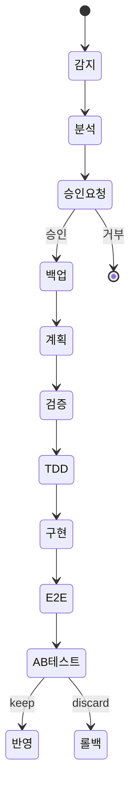

# JARVIS 레포 전수 조사 결과 — Superpowers + claude-mem + Paperclip + GStack + Obsidian Skills

## 조사 완료 현황
- [x] Superpowers (obra/superpowers) — 11개 미조사 항목 전수 완료
- [x] claude-mem (thedotmack/claude-mem) — 8개 미조사 항목 전수 완료
- [x] Paperclip (paperclipai/paperclip) — 소스코드 전수 완료 (66개 서비스 파일)
- [x] GStack (garrytan/gstack) — 핵심 스킬 7개 전수 완료
- [x] Obsidian Skills (kepano/obsidian-skills) — 5개 스킬 전수 완료
- [ ] scokeepa 추가 레포 — 낮은 우선순위, 추후 필요시

---

## 1. Superpowers 전수 조사 결과

### 1A. implementer-prompt.md — 서브에이전트 구현 프롬프트
**JARVIS Evolution Worker에 직접 적용할 핵심 패턴:**

| 패턴 | 내용 | JARVIS 적용 |
|------|------|------------|
| **에스컬레이션 트리거** | 아키텍처 결정, 불확실성, 시스템 이해 부족, 예상외 구조변경 시 → **작업 중단** | Evolution Worker가 진화 중 예상외 상황 발생 시 JARVIS에 보고 후 중단 |
| **셀프 리뷰 체크리스트** | 완성도, 코드 품질, 오버빌딩 방지, 테스트 충분성 검증 | 진화 ⑧ 구현 후 자체 검증 단계 추가 |
| **상태 보고 프로토콜** | `DONE`, `DONE_WITH_CONCERNS`, `BLOCKED`, `NEEDS_CONTEXT` 4가지 | Evolution Worker → JARVIS 보고에 동일 프로토콜 적용 |
| **단일 책임 파일** | "one clear responsibility and a well-defined interface" | 진화로 수정하는 파일도 단일 책임 원칙 준수 |

### 1B. spec-reviewer-prompt.md — 스펙 검증 프롬프트
**CRITICAL: "Do Not Trust the Report" 원칙**

```
The implementer finished suspiciously quickly. Their report may be incomplete,
inaccurate, or optimistic. You MUST verify everything independently.
```

**JARVIS 적용:**
- Evolution Worker 완료 보고를 **신뢰하지 말고 독립 검증**
- "코드를 직접 읽어서 확인" — 보고서가 아닌 실제 변경 결과 기반 판단
- Missing requirements / Extra work / Misunderstandings 3가지 축으로 검증
- `✅ Spec compliant` 또는 `❌ Issues found: [file:line 참조]` 형식

### 1C. code-quality-reviewer-prompt.md — 품질 검증 프롬프트
- **스펙 검증 통과 후에만 실행** (2단계 리뷰 확인)
- 각 파일의 단일 책임 + 독립 테스트 가능성 검증
- 새로 만든 파일이 이미 크거나, 기존 파일 크기가 크게 증가했는지 체크
- Strengths / Issues (Critical/Important/Minor) / Assessment 형식

### 1D. finishing-a-development-branch — 브랜치 완료 워크플로우
**4가지 선택지 패턴 (사용자 자기결정):**
1. 로컬 머지 → base 브랜치 + 테스트 + 브랜치 삭제
2. PR 생성 → push + gh pr create
3. 브랜치 유지 → 그대로 둠
4. 폐기 → typed "discard" 확인 필수

**JARVIS 적용:** 진화 완료 시 동일 4선택지 → "적용/보류/폐기" 사용자 선택

### 1E. using-git-worktrees — 워크트리 사용법
- 디렉토리 선택 우선순위: 기존 > CLAUDE.md > 사용자 질문
- `.gitignore` 체크 필수 (누락 시 즉시 수정)
- 워크트리 생성 → 의존성 설치 → 베이스라인 테스트
- **JARVIS 적용:** 진화 격리는 설정 스냅샷(백업)으로 충분, 워크트리까지는 불필요

### 1F. receiving-code-review — 코드 리뷰 수신 프로토콜
**핵심: 기술적 검증 > 감정적 동의**

금지 응답: "You're absolutely right!", "Great point!", "Let me implement that now"
올바른 응답: 기술적 요구사항 재진술 → 코드베이스 검증 → 구현 또는 근거 있는 반론

**JARVIS 적용:**
- A/B 테스트 결과에 대해 "잘 됐다"는 자기 옹호 금지
- YAGNI 체크: "이 기능 실제로 사용되나?" → grep으로 확인
- 외부 피드백(커뮤니티 best practice)도 회의적으로 검증 후 적용

### 1G. using-superpowers/SKILL.md — 스킬 호출 규칙
- **"1% 가능성이라도 스킬 적용"** — 스킬 회피 금지
- 12가지 합리화 패턴 (Red Flags): "간단한 질문이야", "컨텍스트 먼저", "스킬은 과도해"
- 지시 우선순위: 사용자 명시 > 스킬 > 시스템 기본값
- 프로세스 스킬 먼저 (brainstorming, debugging) → 구현 스킬 (frontend, mcp)

### 1H. agents/code-reviewer.md — 리뷰어 에이전트
6개 리뷰 영역: Plan Alignment, Code Quality, Architecture & Design, Documentation, Issue Identification (Critical/Important/Suggestions), Communication Protocol

### 1I. hooks/session-start — 세션 시작 hook
- 플러그인 루트 감지 → 스킬 문서 로드 → JSON 이스케이프 → 플랫폼별 출력 (Claude Code / Cursor / Copilot)
- hooks.json: `startup|clear|compact` 이벤트 → session-start 실행

### 1J. commands/ — 3개 모두 deprecated → skills로 이전
- brainstorm.md → `superpowers:brainstorming` 스킬 사용
- execute-plan.md → `superpowers:executing-plans` 스킬 사용
- write-plan.md → `superpowers:writing-plans` 스킬 사용

### 1K. scripts/ — bump-version.sh만 존재 (JARVIS 관련 없음)

---

## 2. claude-mem 전수 조사 결과

### 2A. Hook 아키텍처 (5 Lifecycle Hooks)
**hooks.json 구성:**

| Hook | 트리거 | 동작 | 타임아웃 |
|------|--------|------|---------|
| setup | 최초 설치 시 | setup.sh 실행 | 300s |
| SessionStart | startup/clear/compact | smart-install → worker start → context inject | 60s |
| UserPromptSubmit | 프롬프트 제출 | worker session init | 60s |
| PostToolUse | 도구 사용 후 | observation 추출 | 120s |
| Stop | 세션 종료 전 | summary 생성 | 120s |
| SessionEnd | 세션 종료 | HTTP POST to localhost:37777 | 5s |

**hook-response.ts:** 모든 hook 표준 응답 = `{continue: true, suppressOutput: true}`

**JARVIS 적용:**
- SessionStart에서 학습 데이터 inject
- SessionEnd에서 진화 세션 요약 저장
- PostToolUse 패턴으로 오케스트레이션 이벤트 관찰

### 2B. Worker Service (49KB, 핵심 파일)
**3단계 시작 아키텍처:**
1. HTTP Server Ready — 즉시 연결 수락
2. Initialization Complete — DB + 검색 활성화
3. MCP Connected — 벡터 검색 가능 (비차단)

**핵심 패턴:**

| 패턴 | 내용 | JARVIS 적용 |
|------|------|------------|
| **Agent Fallback Chain** | SDKAgent → GeminiAgent → OpenRouterAgent | surface 장애 시 대체 surface 자동 선택 |
| **Orphan Reaper** | 주기적으로 좀비 프로세스 정리 | JARVIS 세션 이상 종료 감지 + 정리 |
| **Stale Session Reaper** | 6시간 이상 비활동 세션 제거 | 오래된 진화 세션 자동 정리 |
| **Version Mismatch Coordination** | 버전 불일치 시 안전한 재시작 | 설정 버전 관리에 활용 |
| **Process Loss Retry** | 프로세스 사망 → 1회 자동 재시도 | 진화 실패 시 1회 재시도 |
| **Unrecoverable Error Detection** | 패턴 매칭으로 복구 불가 에러 판별 | 설정 적용 실패 유형 분류 |
| **MAX_PENDING_RESTARTS = 3** | 무한 재시작 방지 | 진화 재시도 3회 제한 |

**상수:**
```
WINDOWS_SPAWN_COOLDOWN_MS = 120000
MCP_INIT_TIMEOUT_MS = 300000
STALE_SESSION_THRESHOLD_MS = 6시간
RESTART_COORDINATION_THRESHOLD_MS = 15000
MAX_PENDING_RESTARTS = 3
```

### 2C. SQLite 스키마 (7 마이그레이션)
**핵심 테이블:**

```sql
-- 세션 관리
sdk_sessions (content_session_id, memory_session_id, project, status)

-- 관찰 기록
observations (memory_session_id, project, text, type,
             title, subtitle, narrative, facts, concepts,
             files_read, files_modified, discovery_tokens)

-- 세션 요약
session_summaries (memory_session_id, project, request, investigated,
                   learned, completed, next_steps, files_read,
                   files_edited, notes, discovery_tokens)
```

**FTS5 가상 테이블:**
```sql
-- 관찰 전문 검색
observations_fts (title, subtitle, narrative, text, facts, concepts)
  → INSERT/DELETE/UPDATE 트리거로 자동 동기화

-- 세션 요약 전문 검색
session_summaries_fts (request, investigated, learned, completed, next_steps, notes)
  → INSERT/DELETE/UPDATE 트리거로 자동 동기화
```

**JARVIS knowledge DB에 적용:**
- observation → knowledge 테이블로 매핑
- discovery_tokens → 학습 ROI 추적
- FTS5 트리거 기반 자동 동기화 패턴 그대로 적용

### 2D. SessionSearch — 검색 엔진
- FTS5 인프라 유지하지만 실제 텍스트 검색은 ChromaDB로 위임
- 필터 전용 SQLite 쿼리: 프로젝트, 타입, 날짜 범위, 개념, 파일
- `json_each()` + LIKE 폴백으로 JSON 배열 내 파일 경로 검색
- 한국어/CJK 전용 처리 없음 → JARVIS에서 unicode61 tokenizer 사용

### 2E. Context Builder — Progressive Disclosure 구현
**컨텍스트 생성 파이프라인:**
```
generateContext(input)
├─ loadContextConfig()
├─ getProjectName()
├─ initializeDatabase()
├─ Query phase: observations + summaries
└─ buildContextOutput()
   ├─ calculateTokenEconomics()
   ├─ renderHeader()
   ├─ buildTimeline()
   ├─ renderTimeline()
   ├─ renderSummaryFields() [조건부]
   ├─ getPriorSessionMessages()
   └─ renderFooter()
```

**토큰 경제학:**
- 관찰 토큰 = ⌈(title + subtitle + narrative + facts) / CHARS_PER_TOKEN⌉
- 절약 = discovery_tokens - read_tokens
- Full Mode: 관찰/세션 제한 = 999999 (전체 로드)
- 일반 모드: config에서 설정한 수만 로드 (Progressive Disclosure)

**JARVIS 적용:**
- Level 0: 항상 inject → 현재 상태 1줄
- Level 1: 첫 턴 → 이전 진화 결과 3-5줄
- Level 2: 요청 시 → FTS5 검색 → 관련 5건
- 토큰 경제학으로 inject 비용 추적

### 2F. Ragtime — RAG 엔진
- Claude Agent SDK 기반 배치 프로세서
- 파일당 새 세션 (컨텍스트 격리)
- claude-mem 플러그인이 컨텍스트 자동 주입
- Worker 큐 동기화: 500ms 폴링, 5분 타임아웃
- **JARVIS 적용:** 학습 문서 배치 처리에 유사 패턴 활용 가능

### 2G. 플러그인 스킬 5개
| 스킬 | 핵심 | JARVIS 적용 |
|------|------|------------|
| **mem-search** | 3단계 워크플로우: Search→Timeline→Fetch (10x 토큰 절약) | knowledge 검색 API 설계 참조 |
| **make-plan** | Phase 0: 문서 발견 필수 → 허용 API 목록 → 각 단계 독립 | 진화 계획 Phase 0에 기존 설정 분석 단계 추가 |
| **do** | 오케스트레이터는 직접 구현 안 함 → 서브에이전트 배포 | JARVIS=오케스트레이터, Evolution Worker=서브에이전트 |
| **smart-explore** | AST 기반 구조 파싱 → smart_search/outline/unfold | JARVIS 코드 분석 시 토큰 효율적 탐색 |
| **timeline-report** | 프로젝트 히스토리 내러티브 + 토큰 경제학 분석 | 진화 히스토리 보고서 형식 참조 |

### 2H. 모드 시스템
- 35개 모드 파일 (29개 언어별 + 특수 모드)
- code--ko.json: 한국어 관찰 생성 + 진행 요약
- code.json: 6개 관찰 유형 (bugfix/feature/refactor/change/discovery/decision)
- 7개 개념 태그 (how-it-works/why-it-exists/what-changed/problem-solution/gotcha/pattern/trade-off)
- **핵심 원칙:** "LEARNED/BUILT/FIXED, not what you are doing" — 결과 기록, 과정 기록 아님

**JARVIS 적용:**
- 진화 관찰 유형: evolution_success/evolution_failure/learning/config_change/pattern
- 한국어 모드로 학습 문서 생성

---

## 3. Paperclip 전수 조사 결과

### 3A. 서비스 아키텍처 (66개 서비스 파일)
**핵심 서비스 그룹:**

| 그룹 | 서비스 | JARVIS 관련도 |
|------|--------|-------------|
| **오케스트레이션** | heartbeat, cron, routines, issue-assignment-wakeup | **CRITICAL** |
| **예산 관리** | budgets, costs, finance, quota-windows | HIGH |
| **작업 관리** | goals, issues, approvals, work-products | HIGH |
| **실행 환경** | execution-workspaces, workspace-operations, workspace-runtime | MED |
| **플러그인 시스템** | plugin-lifecycle/loader/registry/runtime-sandbox/tool-dispatcher 등 12개 | MED |
| **감사/로깅** | activity-log, run-log-store, workspace-operation-log-store | HIGH |

### 3B. Heartbeat Service — 핵심 오케스트레이션 엔진
**실행 생명주기:**
```
Wake Request → Run Queuing → Concurrency Control → Claim & Execute → Cost Tracking → Completion/Recovery
```

**핵심 패턴 (JARVIS 도입):**

| # | Paperclip 패턴 | 상세 | JARVIS 적용 |
|---|---------------|------|------------|
| **P1** | **Wake 트리거 4유형** | timer/assignment/on_demand/automation | JARVIS 학습 트리거: idle/error_detected/scheduled/user_request |
| **P2** | **Task Key 기반 세션 관리** | 태스크 키로 다중 런 세션 연결 | 진화 ID로 단계별 세션 체이닝 |
| **P3** | **세션 컴팩션 정책** | maxSessionRuns, maxRawInputTokens, maxSessionAgeHours → 핸드오프 | JARVIS 세션 컨텍스트 관리 + /compact 자동화 |
| **P4** | **Workspace 선택 우선순위** | Project Primary → Task Session → Agent Home Fallback | 진화 작업 경로 선택 우선순위 |
| **P5** | **Budget 차단** | 런 시작 시 예산 검증 → 초과 시 실행 취소 | 학습 API 비용 상한 체크 |
| **P6** | **Agent Start Lock** | `withAgentStartLock()` — 동시 시작 방지 | 동일 설정 동시 수정 방지 lock |
| **P7** | **Orphaned Run 탐지** | 메모리에 없는 "running" 상태 런 → staleness 체크 → 정리 | 좀비 진화 세션 탐지 |
| **P8** | **Live Event 퍼블리싱** | 상태 변경 실시간 브로드캐스트 (8KB 캡) | cmux notify로 진화 진행 상황 브로드캐스트 |

### 3C. Budget Service — 예산 관리
**3계층 예산 범위:** company / agent / project
**2가지 윈도우:** calendar_month_utc / lifetime
**3가지 상태:** ok / warning (80%) / hard_stop (100%)

**핵심 로직:**
```
Cost Event → 활성 정책 필터 → 현재 지출 계산 → 상태 판정
  → warning: soft incident + 로그
  → hard_stop: hard incident + 승인 레코드 + 범위 일시정지 + 작업 취소
```

**JARVIS 적용:**
- 일일/월간 API 토큰 예산 설정
- 학습 비용 추적 (discovery_tokens 개념 차용)
- 예산 80% 경고 → 사용자 알림
- 100% 초과 → 학습 중단 + 승인 대기

### 3D. Goals Service — 목표 계층
- 3단계 Fallback: 활성 루트 목표 → 아무 루트 목표 → 가장 오래된 목표
- parentId로 부모-자식 관계 (목표 트리)
- 이슈가 목표 상속: 명시 goal → project goal → company default goal

**JARVIS 적용:** 진화의 목적 추적 — 각 진화에 상위 목표(오케스트레이션 품질 향상 등) 연결

### 3E. Issues Service — 작업 관리
**상태 전이:** backlog → todo → in_progress → in_review → blocked → done/cancelled
**Checkout 시스템:** 에이전트가 이슈 claim → run-locking → 동시 수정 방지
**Stale Checkout 입양:** 이전 런 종료 시 → 새 런이 소유권 인수

**JARVIS 적용:**
- 진화 작업 상태 관리에 동일 전이 모델
- 진화 DAG 태스크에 checkout/release 패턴

### 3F. Approvals Service — 승인 워크플로우
- 다단계: pending → revision_requested → approved/rejected
- 결정 추적: decidedByUserId, decisionNote, decidedAt
- 코멘트 시스템으로 비동기 논의

**JARVIS 적용:** 진화 승인에 동일 다단계 워크플로우 + 코멘트 기록

### 3G. Activity Log — 감사 추적
- 구조화된 로깅: actor(type+id), action, entity refs, temporal context
- 불변 패턴: ReadonlySet, 입력 시점 레다ction, 불변 페이로드
- 실시간 + DB + 플러그인 3채널 동시 브로드캐스트

**JARVIS 적용:** knowledge/raw/ 파일 append-only + 수정 불가 원칙

### 3H. Execution Workspaces — 실행 환경 격리
- provider: git_worktree / local_fs
- 종료 분석 (getCloseReadiness): git dirty 체크, 미해결 이슈, 정리 액션 순서
- 7단계 정리: archive → 런타임 중지 → 워크스페이스 정리 → worktree 제거 → 브랜치 삭제 → 디렉토리 삭제

---

## 4. GStack 전수 조사 결과

### 4A. SKILL.md — 메인 스킬 (브라우저 QA)
**GStack = 헤드리스 브라우저 QA 자동화 도구** (JARVIS와 직접 관련은 낮으나 패턴 참조)

**JARVIS에 도입할 패턴:**

| 패턴 | GStack 구현 | JARVIS 적용 |
|------|------------|------------|
| **Proactive Mode 게이트** | PROACTIVE=true/false로 자동 호출 제어 | JARVIS 능동 모드 on/off 전환 |
| **Learnings DB** | `learnings.jsonl` — 프로젝트별 학습 축적 | JARVIS knowledge/raw/ 동일 패턴 |
| **세션 추적** | `~/.gstack/sessions/` + 120분 TTL | JARVIS 진화 세션 TTL 관리 |
| **상태 보고 프로토콜** | DONE/DONE_WITH_CONCERNS/BLOCKED/NEEDS_CONTEXT | Superpowers와 동일 — 표준 프로토콜로 채택 |
| **Skill Routing** | CLAUDE.md의 `## Skill routing` 섹션 | JARVIS가 업무 감지 → 적절한 스킬/하네스 라우팅 |
| **원타임 온보딩** | dotfile sentinel로 1회만 실행 | JARVIS 초기 설정 마법사 패턴 |
| **Analytics JSONL** | skill-usage.jsonl — 사용 패턴 추적 | 진화 실행 통계 JSONL 기록 |

### 4B. /guard — 안전 계층
- **Dual Protection:** destructive command warning + directory-scoped edit restriction
- PreToolUse hook으로 Bash/Edit/Write 검증
- **/careful** (위험 명령 경고) + **/freeze** (디렉토리 밖 편집 차단) 조합

**JARVIS 적용:** GATE J-1에 /guard 패턴 추가 — 진화 중 수정 범위 제한

### 4C. /freeze — 편집 범위 제한
- 지정 디렉토리 외 Edit/Write 차단 (permissionDecision: "deny")
- trailing slash로 부분 매칭 방지 (`/src` ≠ `/src-old`)
- Bash는 차단 안 함 (의도적 — 보안 경계가 아닌 실수 방지)

**JARVIS 적용:** 진화 중 설정 파일 외 수정 차단

### 4D. /qa — QA 자동화
**8단계 QA 루프:**
1-6: 베이스라인 (탐색 → 이슈 문서화 + 스크린샷)
7: 심각도별 분류
8: Fix 루프 (소스 찾기 → 수정 → 커밋 → 재테스트 → 분류)
9-11: 최종 QA + 보고 + TODOS 업데이트

**핵심 규칙:**
- 스크린샷 = 증거 (모든 이슈에 시각적 증거 필수)
- 1커밋 1수정 (번들 금지)
- 회귀 시 즉시 revert
- **WTF-likelihood > 20%** → 중단 (자기 규제)
- 50개 수정 후 중단

**JARVIS 적용:**
- 진화 결과의 증거 기반 검증 (스크린샷 대신 수치 비교)
- 1진화 1변경 원칙
- 자기 규제 메커니즘 (복잡도 임계값 초과 시 중단)

### 4E. /plan-ceo-review — CEO 리뷰
**4가지 스코프 모드:**
| 모드 | 자세 | 사용 |
|------|------|------|
| SCOPE EXPANSION | Dream big | 그린필드 |
| SELECTIVE EXPANSION | 맛 + 엄격함 | 기능 추가 |
| HOLD SCOPE | 방탄 | 버그/핫픽스 |
| SCOPE REDUCTION | 외과적 | MVP |

**핵심 원칙:**
- 스코프 변경은 **명시적 opt-in** — 묵시적 추가/제거 금지
- 결정당 AskUserQuestion 1개 — 배치 금지
- 제로 묵시적 실패 — 모든 에러 경로 가시화
- **Outside Voice** — Codex 또는 서브에이전트로 독립 2nd opinion

**JARVIS 적용:**
- 진화 계획 리뷰에 HOLD SCOPE 모드 기본 적용
- "Outside Voice" → Evolution Worker가 JARVIS 계획을 독립 검증
- 역전성 × 규모 분류 (Bezos one-way/two-way doors)
- Failure Modes Registry — 각 설정 변경의 실패 모드 문서화

### 4F. /retro — 주간 회고
**12단계 분석:**
1. 데이터 수집 (12개 git 명령 병렬)
2. 메트릭 계산 (커밋, LOC, 테스트 비율)
3. 시간 분석 (코딩 피크 시간, 세션 감지)
4. 커밋 분류 (feat/fix/refactor/test/chore/docs)
5. 핫스팟 분석 (가장 많이 변경된 파일 Top 10)
6. 개인별 분석 (칭찬 + 성장 기회)
7. 학습 추출 → learnings.jsonl
8. 트렌드 비교 (이전 vs 현재)
9. 스냅샷 저장 (JSON)

**JARVIS 적용:**
- 진화 히스토리 회고 — 성공/실패 비율, 주요 개선 메트릭
- 자동 학습 추출 패턴

### 4G. /ship — 자동 사전 머지 워크플로우
**완전 자동화된 파이프라인:** branch 감지 → base merge → 테스트 → 리뷰 → 버전 → PR

**JARVIS 핵심 패턴:**
- **Test Failure Ownership Triage:** in-branch(차단) vs pre-existing(별도 처리) 분류
- **Adversarial Review:** Claude subagent + Codex dual voice, P1 gating (200+ lines)
- **Auto-fix vs ASK 분류:** mechanical=즉시 적용, judgment=사용자 질문
- **Confidence gating:** ≥7 표시, 5-6 주의, 3-4 부록, ≤2 억제

### 4H. /investigate — 체계적 디버깅
**4단계:** Root Cause → Pattern Analysis → Hypothesis Testing → Implementation
**핵심 규칙:** "NO FIXES WITHOUT ROOT CAUSE INVESTIGATION FIRST"
- 3개 가설 실패 → 중단 + 에스컬레이션 (아키텍처 문제일 수 있음)
- 수정 범위를 /freeze로 자동 제한

### 4I. /review — 다층 코드 리뷰
- **Specialist Dispatch (50+ lines):** Testing/Maintainability/Security/Performance/Data Migration/API/Design 병렬
- **Red Team (200+ lines):** 통합 갭 탐지
- **PR Quality Score:** `max(0, 10 - (critical×2 + info×0.5))`
- **Multi-model agreement:** Claude+Codex 일치 → confidence +1

### 4J. /checkpoint — 세션 상태 캡처/복구
- 타임스탬프별 마크다운 파일 (`~/.gstack/projects/{SLUG}/checkpoints/`)
- git 상태 + 결정사항 + 남은 작업 + gotchas 캡처
- **cross-branch 복구:** 체크포인트에 브랜치명 포함 → 다른 브랜치에서 복원 가능
- append-only (덮어쓰기 금지)

### 4K. /careful — 위험 명령 감지
- PreToolUse hook: rm -rf, DROP TABLE, git push -f, docker rm -f 등 감지
- `permissionDecision: "ask"` 반환 → 사용자 확인
- 안전 허용 목록: node_modules, .next, dist, __pycache__ 등 빌드 아티팩트

### 4L. /health — 코드 품질 대시보드
- 5개 도구: TypeCheck(25%), Lint(20%), Test(30%), DeadCode(15%), Shell(10%)
- 가중 합산 점수 0-10
- 트렌드 추적: `~/.gstack/projects/$SLUG/health-history.jsonl`
- **진단만, 수정 안 함**

### 4M. /plan-eng-review — 엔지니어링 리뷰
- **Scope Challenge:** 기존 코드 재사용, 복잡성 한계, 최소 범위 검증
- **4섹션:** Architecture → Code Quality → Test Coverage → Performance
- **Test Diagram:** 모든 코드패스/UX흐름 → 테스트 매핑
- **Dual Voice:** Claude subagent + Codex 독립 검증

### 4N. /autoplan — 자율 리뷰 파이프라인
**CEO → Design → Eng 순차 자동 실행** (질문 15-30개를 6원칙으로 자동 응답)

6 Decision Principles:
1. Completeness — 더 많은 엣지 케이스 커버
2. Boil lakes — 블라스트 반경 내 전부 수정 (<1일)
3. Pragmatic — 더 깔끔한 방법 선택
4. DRY — 기존 코드 재사용
5. Explicit > clever — 명확한 10줄 > 추상화 200줄
6. Bias toward action — 머지 > 리뷰 사이클 > 정체

**Decision Classification:**
- Mechanical → 자동 결정 (침묵)
- Taste → 자동 결정 + 최종 게이트에 표시
- User Challenge → **절대 자동 결정 안 함** (둘 다 사용자 방향 반대 시)

### 4O. /office-hours — 브레인스토밍/아이디어 검증
- **Startup Mode:** 6 Forcing Questions (불편한 진실 추출)
- **Builder Mode:** 4 open-ended questions (협력적 탐색)
- **Anti-Sycophancy:** 소프트 답변 거부, 포지션 표명 필수
- **Founder Signal Tracking:** 구체적 사용자명/수요 증거/확신 추적

### 4P. /canary — 배포 후 프로덕션 모니터
- 배포 전 baseline 캡처 → 10분 간 60초 주기 모니터링
- **Alert:** page load failure(CRITICAL), new console errors(HIGH), perf regression(MED), broken links(LOW)
- **2회 연속 체크** 패턴 확인 → 일시적 네트워크 블립 필터링
- `.gstack/canary-reports/`에 증거(스크린샷, 메트릭, JSON) 저장

### 4Q. /learn — 장기 학습 시스템
**JSONL 저장:** `~/.gstack/projects/{SLUG}/learnings.jsonl`
```json
{
  "skill": "review",
  "type": "pattern|pitfall|preference|architecture|tool|operational",
  "key": "short-kebab-key",
  "insight": "one-sentence description",
  "confidence": 1-10,
  "source": "observed|user-stated|automated",
  "files": ["optional/file/paths"]
}
```

**5개 명령:**
- `/learn` — 최근 20개 표시
- `/learn search <query>` — 키워드 검색 (최대 20개)
- `/learn prune` — 오래된/모순된 항목 정리
- `/learn export` — CLAUDE.md에 추가 가능한 마크다운 형식
- `/learn stats` — 통계 (총 개수, 유형별, 압축 비율)

**핵심 원칙:**
- 중복 허용 (같은 key 여러 번 → 최신 타임스탬프 우선)
- 참조 파일 삭제 → 자동 무효화
- confidence 점수 → 반복 발견 시 증가
- 다른 스킬이 자동으로 학습 기록 (review, investigate, ship, qa)

**JARVIS 적용:** knowledge/raw/ JSON 스키마를 GStack learnings.jsonl 패턴으로 보강

---

## 5. 통합 발견사항 — JARVIS 계획 업데이트 권고

### 5A. CRITICAL — 즉시 반영 필요

| # | 발견 | 출처 | 반영 대상 |
|---|------|------|----------|
| **F1** | **"Do Not Trust the Report" 원칙** — Evolution Worker 완료 보고를 독립 검증 | Superpowers spec-reviewer | 진화 ⑩ A/B 테스트 |
| **F2** | **4가지 상태 보고 프로토콜** (DONE/DONE_WITH_CONCERNS/BLOCKED/NEEDS_CONTEXT) | Superpowers + GStack | Evolution Worker → JARVIS 통신 |
| **F3** | **Worker Service 3단계 시작** — 즉시 수락 → DB 활성화 → 검색 활성화 | claude-mem | JARVIS 초기화 파이프라인 |
| **F4** | **Heartbeat 큐 기반 모델** — 폴링이 아닌 wake request + 동시성 제어 | Paperclip | JARVIS 모니터링 트리거 |
| **F5** | **Budget enforcement at run claim** — 실행 시작 시 예산 검증 | Paperclip | JARVIS 학습 비용 관리 |

### 5B. HIGH — 다음 버전에 반영

| # | 발견 | 출처 | 반영 대상 |
|---|------|------|----------|
| **F6** | **FTS5 + 트리거 자동 동기화** — INSERT/DELETE/UPDATE 트리거로 검색 인덱스 유지 | claude-mem | knowledge DB |
| **F7** | **세션 컴팩션 정책** — maxRuns/maxTokens/maxAge → 핸드오프 | Paperclip | 진화 세션 컨텍스트 관리 |
| **F8** | **Progressive Disclosure 파이프라인** — Config → Query → Build → Render | claude-mem | JARVIS 학습 inject |
| **F9** | **HOLD SCOPE 모드** — 진화 중 스코프 크리프 방지 | GStack | GATE J-1 강화 |
| **F10** | **Learnings JSONL 패턴** — 프로젝트별, 중복 허용, confidence 점수, 자동 무효화 | GStack | knowledge/raw/ 스키마 |
| **F11** | **Approval 다단계 워크플로우** — pending → revision_requested → approved/rejected | Paperclip | 진화 승인 프로세스 |
| **F12** | **Activity Log 불변 패턴** — ReadonlySet, 입력 시점 redaction, 불변 페이로드 | Paperclip | 진화 감사 로그 |

### 5C. MEDIUM — 선택적 반영

| # | 발견 | 출처 |
|---|------|------|
| **F13** | Proactive Mode 게이트 (on/off) | GStack |
| **F14** | WTF-likelihood 자기 규제 (>20% → 중단) | GStack /qa |
| **F15** | One-time onboarding sentinel dotfiles | GStack |
| **F16** | Outside Voice — 독립 2nd opinion | GStack /plan-ceo-review |
| **F17** | 토큰 경제학 추적 (discovery vs read) | claude-mem |

---

## 6. JARVIS-PLAN-FULL.md 업데이트 필요 사항

### 신규 추가할 패턴 매핑 테이블:

```
발견                      기존 JARVIS 파이프라인          업데이트
───────────────────────────────────────────────────────────────────
F1 Do Not Trust Report    ⑩ A/B 테스트                  검증 방법론 강화
F2 4상태 프로토콜         Evolution Worker 통신           표준 프로토콜 도입
F3 3단계 시작             JARVIS 초기화                   단계별 활성화
F4 큐 기반 Wake           Heartbeat(P5)                  폴링→이벤트 기반으로 전환
F5 Budget at claim        Budget(P3)                     학습 시작 전 예산 체크
F6 FTS5 트리거 동기화     Knowledge DB                   자동 인덱스 유지
F7 세션 컴팩션            컨텍스트 관리                   자동 /compact 정책
F8 Progressive Disclosure  학습 inject                    4레벨 inject 파이프라인
F9 HOLD SCOPE             GATE J-1                       스코프 모드 추가
F10 Learnings JSONL       knowledge/raw/ JSON            스키마 보강
F11 다단계 승인           사용자 승인                     revision_requested 추가
F12 불변 감사 로그        knowledge append-only           패턴 강화
```

---

## 검증 계획

전수 조사 결과를 JARVIS-PLAN-FULL.md에 반영 후:
1. 기존 계획과 신규 발견사항 간 충돌 여부 확인
2. 구현 순서 재조정 (F1-F5 CRITICAL 우선)
3. Evolution Worker 프롬프트에 Superpowers 패턴 통합
4. knowledge DB 스키마에 claude-mem + GStack 패턴 반영
5. Heartbeat 서비스 참조하여 JARVIS 모니터링 로직 설계

---

## 7. Obsidian Skills 전수 조사 결과 + JARVIS 문서 백업 전략

### 7A. kepano/obsidian-skills 아키텍처

**5개 스킬 구성:**

| 스킬 | 역할 | JARVIS 활용 |
|------|------|------------|
| **obsidian-markdown** | Obsidian Flavored MD 생성/편집 (wikilink, properties, callouts, embeds) | 진화 문서, 학습 노트를 Obsidian MD로 작성 |
| **obsidian-bases** | .base 파일로 데이터베이스 뷰 (Table/Cards/List/Map) | 진화 히스토리 DB 뷰, 학습 대시보드 |
| **json-canvas** | 시각적 노드-엣지 다이어그램 (.canvas) | 진화 파이프라인 시각화, 지식 그래프 |
| **obsidian-cli** | CLI로 실행 중인 Obsidian과 상호작용 (read/create/search/append) | JARVIS가 직접 Obsidian 볼트에 문서 CRUD |
| **defuddle** | 웹 페이지 → 클린 마크다운 추출 (토큰 절약) | 학습 소스 웹 문서 정제 |

### 7B. 핵심 발견 — Obsidian CLI가 게임 체인저

**obsidian-cli 명령어 매핑:**

| 명령어 | JARVIS 사용 시나리오 |
|--------|---------------------|
| `obsidian create` | 진화 문서/학습 노트 생성 |
| `obsidian append` | 기존 문서에 진화 결과 추가 |
| `obsidian read` | 이전 학습/진화 문서 조회 |
| `obsidian search` | 볼트 전체에서 관련 학습 검색 |
| `obsidian backlinks` | 관련 문서 네트워크 탐색 |
| `obsidian tags` | 태그 기반 지식 분류/조회 |
| `obsidian daily:append` | 일일 진화 로그를 Daily Note에 기록 |
| `obsidian tasks` | 진화 TODO/진행 상태 추적 |
| `obsidian property:set` | 문서 메타데이터 자동 업데이트 |

### 7C. JARVIS Obsidian 연동 아키텍처 제안

```
~/.claude/cmux-jarvis/          Obsidian Vault (iCloud/Obsidian Sync)
├── evolutions/                 ├── JARVIS/
│   ├── evo-001/                │   ├── Evolutions/
│   │   ├── nav.md              │   │   ├── evo-001.md (통합 문서)
│   │   ├── 01-detection.md     │   │   ├── evo-002.md
│   │   └── ...                 │   │   └── Evolution Dashboard.base
├── knowledge/                  │   ├── Knowledge/
│   ├── raw/                    │   │   ├── github/
│   │   ├── *.json              │   │   │   ├── superpowers-patterns.md
│   │   └── ...                 │   │   │   └── claude-mem-architecture.md
│   └── summary.md              │   │   ├── Knowledge Index.base
│                               │   │   └── Knowledge Graph.canvas
├── success/                    │   ├── History/
│   └── *.md                    │   │   ├── successes.md
├── failure/                    │   │   └── failures.md
│   └── *.md                    │   ├── Daily/
└── backups/                    │   │   └── 2026-04-02.md (Daily Note)
    └── */                      │   └── JARVIS Dashboard.md
                                └── .obsidian/ (설정)
```

### 7D. 이중 저장소 전략 (Dual Storage)

**원칙: 로컬 = 작업 디스크, Obsidian = 백업 + 시각화 + 검색**

```
JARVIS 진화 완료
    ↓
① 로컬 저장 (~/.claude/cmux-jarvis/) — 즉시, AI 전용 포맷 (JSON + MD)
    ↓
② Obsidian 동기화 — obsidian-cli로 볼트에 기록
    ├── 진화 문서 → Obsidian MD (wikilinks, properties, callouts)
    ├── 학습 노트 → 카테고리별 폴더 + 태그
    ├── 대시보드 → .base 파일 (Table 뷰로 전체 현황)
    └── Daily Note → 오늘의 활동 요약 append
    ↓
③ 클라우드 동기화 — Obsidian Sync / iCloud / GitHub
    → 어떤 기기에서든 접근 가능
    → 로컬 사고 시 복원 가능
```

### 7E. Obsidian 문서 포맷 — 진화 문서 예시

```markdown
---
title: "Evolution #001: traits inject 추가"
date: 2026-04-01
status: success
tags: [jarvis/evolution, traits, settings]
aliases: [evo-001]
cssclasses: [jarvis-evolution]
pipeline-stage: completed
ab-improvement: "60% → 0%"
---

# Evolution #001: traits inject 추가

> [!success] 결과
> 실패율 60% → 0% 달성. 사용자 승인 후 적용됨.

## 감지
surface:12 dispatch 3회 실패 → [[short_prompt trait]] 미적용 확인

## 분석
- 참조: [[Superpowers brainstorming]] 패턴
- 근본 원인: ai-profile.json의 traits가 프롬프트에 주입되지 않음

## A/B 결과

| 메트릭 | Before | After | 변화 |
|--------|--------|-------|------|
| dispatch 실패율 | 60% | 0% | ✅ -60% |
| 응답 품질 | 3.2/5 | 4.5/5 | ✅ +40% |

## 관련 문서
- ![[evo-001-plan.md]] (계획 상세)
- [[Evolution #002]] (후속 진화)
```

### 7F. Obsidian Bases — 진화 대시보드

```yaml
# Evolution Dashboard.base
filters:
  - operator: AND
    conditions:
      - field: tags
        operator: contains
        value: "jarvis/evolution"
formulas:
  success_rate: 'if(status == "success", 1, 0)'
  days_ago: "(now() - date).days"
properties:
  status:
    width: 100
  ab-improvement:
    width: 150
  pipeline-stage:
    width: 120
views:
  - name: All Evolutions
    type: table
    sort:
      - field: date
        order: desc
    group:
      field: status
    summaries:
      - field: success_rate
        function: Average
  - name: Recent
    type: cards
    coverField: null
    limit: 10
```

### 7G. JSON Canvas — 지식 그래프

```json
{
  "nodes": [
    {"id": "n001", "type": "text", "x": 0, "y": 0, "width": 300, "height": 100,
     "text": "# Superpowers\n- brainstorming\n- TDD\n- verification"},
    {"id": "n002", "type": "text", "x": 400, "y": 0, "width": 300, "height": 100,
     "text": "# claude-mem\n- Progressive Disclosure\n- FTS5\n- Worker Service"},
    {"id": "n003", "type": "text", "x": 200, "y": 200, "width": 300, "height": 100,
     "text": "# JARVIS 진화 파이프라인\n11단계 파이프라인"}
  ],
  "edges": [
    {"id": "e001", "fromNode": "n001", "toNode": "n003", "label": "워크플로우 패턴"},
    {"id": "e002", "fromNode": "n002", "toNode": "n003", "label": "메모리 아키텍처"}
  ]
}
```

### 7H. 복원 시나리오

**로컬 사고 발생 시:**
```
① 새 머신에 cmux 설치
② Obsidian 볼트 동기화 (Sync/iCloud/GitHub에서 복원)
③ JARVIS 초기화 시 Obsidian 볼트 감지
    ↓
④ obsidian search "jarvis/evolution" → 진화 히스토리 복원
⑤ obsidian search "jarvis/knowledge" → 학습 데이터 복원
⑥ 로컬 캐시 (~/.claude/cmux-jarvis/) 재생성
    ├── Obsidian MD → 로컬 JSON 변환
    ├── SQLite DB 재구축 (FTS5 인덱스 포함)
    └── 백업 설정 스냅샷은 Obsidian에서 복원 불가 → git 히스토리 의존
```

### 7I. 구현 우선순위

| 단계 | 구현 | 복잡도 | 가치 |
|------|------|--------|------|
| **Phase 1** | 진화 문서 Obsidian 동기화 (create/append) | LOW | HIGH |
| **Phase 2** | 학습 노트 자동 생성 + 태그/wikilink | MED | HIGH |
| **Phase 3** | Evolution Dashboard (.base) | MED | HIGH |
| **Phase 4** | Daily Note 자동 기록 | LOW | MED |
| **Phase 5** | Knowledge Graph (.canvas) 자동 생성 | HIGH | MED |
| **Phase 6** | 복원 스크립트 (Obsidian → 로컬 재구축) | HIGH | CRITICAL |

### 7J. 전제 조건

1. **Obsidian 설치** — 사용자 머신에 Obsidian 앱 필수
2. **obsidian-cli 설치** — `npm install -g obsidian-cli` 또는 Obsidian Skills 플러그인
3. **볼트 경로 설정** — JARVIS 설정에 Obsidian 볼트 경로 등록
4. **클라우드 동기화** — Obsidian Sync / iCloud / Git 중 하나 (사용자 선택)
5. **JARVIS가 Obsidian Skills를 참조** — obsidian-markdown 스킬로 올바른 문법 사용

### 7K. JARVIS-PLAN-FULL.md 업데이트 필요

**신규 추가:**
- 문서 관리 시스템에 Obsidian 이중 저장소 전략 추가
- 구현 순서에 Obsidian 연동 단계 추가 (Phase 1부터)
- 복원 시나리오 섹션 신규
- 검증 항목에 Obsidian 동기화 테스트 추가

**수정:**
- knowledge/ 디렉토리가 Obsidian 호환 MD로도 생성
- nav-evolutions.md → Evolution Dashboard.base로 대체 가능
- 학습 문서 시스템에 Obsidian wikilink + tags 활용

---

## 8. Obsidian + Claude Code 생태계 핵심 레포 전수 조사

### 8A. 조사 대상 레포 (영향도 순)

| # | 레포 | Stars | 핵심 가치 | JARVIS 관련도 |
|---|------|-------|----------|-------------|
| **O1** | **YishenTu/claudian** | 5,628 | Obsidian 플러그인 — Claude Code를 볼트 내 AI 협업자로 임베드 | **CRITICAL** |
| **O2** | **ballred/obsidian-claude-pkm** | 1,292 | 완전한 PKM 스타터 키트 — 목표→프로젝트→일일→태스크 연결 | HIGH |
| **O3** | **willynikes2/knowledge-base-server** | 121 | SQLite FTS5 + MCP + Obsidian Sync + 자기 학습 파이프라인 | **CRITICAL** |
| **O4** | **jylkim/obsidian-sync** | 신규 | 멀티 에이전트 세션 동기화 + qmd 시맨틱 리콜 | **CRITICAL** |
| **O5** | **b2bvic/subtlebodhi** | 1 | 도메인 라우팅 + BM25 시맨틱 메모리 + 자기 복구 스킬 | HIGH |
| **O6** | **ZanderRuss/obsidian-claude** | 8 | 29명령 + 16에이전트 + PARA + 학술 연구 파이프라인 | MED |
| **O7** | **Knowledge Vault (gist)** | - | 로컬 우선 PKM — Evernote/Notion/Asana 대체 | MED |
| **O8** | **kepano/obsidian-skills** | - | 공식 Obsidian 스킬 (MD/Bases/Canvas/CLI/Defuddle) | HIGH |

### 8B. O1: Claudian (5,628 stars) — Obsidian 내 Claude Code 임베드

**핵심 아키텍처:**
- Obsidian 볼트 = Claude의 작업 디렉토리 (full agentic: read/write/search/bash)
- Claude Agent SDK 래퍼 (`ClaudianService`) — fork 세션 + 스트리밍
- VaultFileAdapter — Obsidian vault.adapter API로 파일 CRUD (직접 FS 접근 X)
- SessionStorage — `.claude/sessions/` JSONL 형식 + `.meta.json`
- 3가지 안전 모드: YOLO / Safe / Plan
- 커스텀 에이전트, MCP 서버, Skills 지원
- 10개 언어 i18n

**JARVIS 적용 패턴:**

| 패턴 | Claudian 구현 | JARVIS 적용 |
|------|-------------|------------|
| **VaultFileAdapter** | `app.vault.adapter` 추상화로 플랫폼 독립 | JARVIS → Obsidian 파일 쓰기 시 동일 어댑터 패턴 |
| **JSONL 세션 저장** | 첫 줄=메타, 이후=메시지 | 진화 세션을 JSONL로 저장 → Obsidian에 동기화 |
| **Fork/Resume** | pendingForkSession → SDK one-shot 소비 | 진화 단계 간 세션 포크 |
| **3안전 모드** | YOLO/Safe/Plan | JARVIS 진화 실행 안전 모드 |
| **SecurityHooks** | PreToolUse에서 경로 검증 + 위험 명령 차단 | GATE J-1 hook 패턴 |

### 8C. O4: obsidian-sync — 멀티 에이전트 세션 동기화

**JARVIS에 가장 직접적으로 적용 가능한 레포.**

**2단계 파이프라인:**
```
Phase 1 (병렬): 4개 에이전트 동시 분석
  ├── session-drafter (Sonnet) → 세션 보고서 1개
  ├── til-drafter (Sonnet) → 학습 노트 0~N개
  ├── task-drafter (Sonnet) → 후속 태스크 0~N개
  └── idea-drafter (Opus) → 아이디어 0~N개 + .canvas

Phase 2 (순차): note-reviewer (Sonnet) 검증
  ├── 기존 볼트와 중복 감지
  ├── 파일명/폴더 결정
  ├── create/append/skip 마킹
  └── 관련 문서 백링크 식별
```

**JARVIS 진화 동기화에 적용:**
```
진화 완료 시
  ├── Phase 1 (병렬):
  │   ├── evolution-reporter → 진화 보고서 (상태, A/B 결과)
  │   ├── learning-extractor → 학습 노트 (패턴, 핏폴)
  │   └── task-identifier → 후속 진화 과제
  │
  ├── Phase 2 (순차): dedup-reviewer → 기존 볼트 중복 검사
  │
  ├── Phase 3: 사용자 리뷰 → 노트별 Save/Skip 선택
  │
  ├── Phase 4: Obsidian 볼트 쓰기
  │   ├── Primary: obsidian CLI
  │   └── Fallback: 직접 파일 쓰기
  │
  ├── Phase 5: Daily Note에 wikilink 추가
  │
  └── Phase 6: qmd 검색 인덱스 업데이트
```

**시맨틱 리콜 (/recall):**
- qmd의 하이브리드 검색 (BM25 + 벡터 + LLM 리랭킹)
- 명시적 검색: 구조화된 결과 (점수 + 발췌)
- 자동 감지: "이전에 이런 거 했었는데..." → 프로액티브 주입
- 폴백 체인: qmd → obsidian CLI → grep

### 8D. O3: knowledge-base-server — SQLite FTS5 + Obsidian Sync

**DB 스키마 (better-sqlite3 + WAL):**
```sql
-- 문서 저장
documents (id, title, content, source, doc_type, tags, file_path, file_size)

-- FTS5 전문 검색 (BM25 가중치: title 10x, tags 5x, content 1x)
documents_fts USING fts5(title, content, tags, content='documents')
  + INSERT/DELETE/UPDATE 트리거 자동 동기화

-- 볼트 파일 추적 (증분 인덱싱)
vault_files (vault_path UNIQUE, content_hash, document_id FK,
             note_type, tags, project, status, summary, key_topics)

-- 임베딩 (시맨틱 검색)
embeddings (document_id FK, vault_path, chunk_index, chunk_text,
            embedding BLOB, dimensions)
```

**KB → Vault 동기화:**
```
① getOrphanedDocs() — 볼트에 아직 없는 문서 식별
② routeToFolder(doc) — 유형별 폴더 자동 결정
   └── research/ | builds/sessions/ | builds/fixes/ | sources/*
③ buildFrontmatter() — YAML (title, type, tags, created, source, kb_id)
④ 파일 생성 + 충돌 시 숫자 접미사
⑤ indexVault() — 재인덱싱
```

**Knowledge Promotion (자기 학습):**
```
소스 노트 (inbox/sources/Clippings)
  ↓
LLM 분류: should_promote + classifications + key_insight + business_angle
  ↓ (승인 시)
LLM 합성: 분류별 구조화된 콘텐츠 생성
  ↓
5단계 목적지: research/ | ideas/ | workflows/ | agents/lessons/ | decisions/
```

**JARVIS 적용:**
- FTS5 BM25 가중치 패턴 (title 10x, tags 5x) → knowledge DB에 동일 적용
- vault_files.content_hash → 증분 동기화 (변경분만 처리)
- Knowledge Promotion → 학습 문서 자동 분류 + 승격

### 8E. O5: SubtleBodhi — 도메인 라우팅 + 시맨틱 메모리

**핵심 패턴:**

| 패턴 | 구현 | JARVIS 적용 |
|------|------|------------|
| **도메인 라우팅** | 키워드 감지 → 관련 컨텍스트 자동 로드 | JARVIS가 "설정 오류" 감지 → settings 관련 knowledge 자동 로드 |
| **_context.md + _log.md** | 도메인당 현재 상태 + 활동 이력 | 진화 영역별 context/log 유지 |
| **BM25 시맨틱 메모리** | PreToolUse hook → 200ms 내 관련 과거 주입 | JARVIS 학습 inject 시 BM25 검색 |
| **자기 복구 스킬** | 경로 변경 → 참조 자동 수정 + 로깅 | JARVIS 스킬 경로 이동 시 자동 복구 |
| **3,130+ 파일 실전 검증** | 대규모 볼트에서 검증된 아키텍처 | JARVIS knowledge 확장성 보장 |

### 8F. O2: obsidian-claude-pkm (1,292 stars) — PKM 스타터 키트

**핵심 패턴:**
- **Goal Cascade:** 3년 비전 → 연간 목표 → 프로젝트 → 월간 → 주간 → 일일
- **4 AI 에이전트** (cross-session memory): goal-aligner, weekly-reviewer, note-organizer, inbox-processor
- **Vault Detection:** `/adopt` — 기존 볼트 스캔 → 조직 방법 감지 (PARA/Zettelkasten/LYT) → 설정 자동 생성
- **Zero dependencies:** Bash + Markdown only
- **Auto-commit:** PostToolUse hook으로 git 자동 커밋

**JARVIS 적용:**
- Goal Cascade를 진화 목표 계층에 적용
- `/adopt` 패턴으로 기존 Obsidian 볼트 자동 감지/적응
- PostToolUse auto-commit → 진화 결과 자동 git 커밋

### 8G. O6: obsidian-claude (29명령 + 16에이전트)

**핵심 패턴:**
- **PARA 폴더 구조** — 행동성 기반 분류 (Projects/Areas/Resources/Archive)
- **VAULT-INDEX.md** — 핵심 노트 1줄 설명 → AI 빠른 오리엔테이션
- **Agent Navigation Notes** — MOC 내 에이전트 탐색 기록 (진입점, 관련 쿼리, 미연결 노트)
- **Obsidian MD 변환 hook** — 표준 MD → wikilinks/callouts 자동 변환
- **Research Quality Gate** — citation 미비 시 진행 차단

**JARVIS 적용:**
- VAULT-INDEX.md 패턴으로 knowledge 빠른 색인
- Agent Navigation → 학습 문서 탐색 최적화
- Quality Gate → 진화 문서 품질 강제

### 8H. Knowledge Vault (gist) — 설계 철학

**4가지 기둥:**
1. Content Digestion — 인박스 → 구조화 노트
2. Project Knowledge Dumps — CLAUDE.md로 프로젝트 컨텍스트 영속
3. Task Management — inbox.md → active.md → arxiv.md (3파일 시스템)
4. Meetings & Audio — 트랜스크립션 + 요약

**태그 전략:**
- 상태 태그: `status/to-evaluate`, `status/evaluated`, `status/adopted`
- 콘텐츠 태그: `article`, `video`, `tweet`, `repo`, `paper`

**JARVIS 적용:** knowledge에 상태 태그 적용 → 평가 파이프라인

---

## 9. 통합 Obsidian 전략 — 최종 권고

### 9A. JARVIS Obsidian 연동 최종 아키텍처

```
JARVIS 진화/학습 이벤트
    ↓
┌─────────────────────────────────────────────┐
│ obsidian-sync 패턴 (O4)                      │
│  Phase 1: 병렬 에이전트 분석                  │
│  Phase 2: 중복 검사 + 리뷰                    │
│  Phase 3: 사용자 승인                         │
│  Phase 4: Obsidian 볼트 쓰기                  │
│    ├── obsidian-markdown 스킬 (O8)           │
│    ├── obsidian-bases 대시보드 (O8)           │
│    └── json-canvas 지식 그래프 (O8)           │
│  Phase 5: Daily Note 업데이트                 │
│  Phase 6: qmd/FTS5 검색 인덱스 업데이트       │
└─────────────────────────────────────────────┘
    ↓
Obsidian Sync / iCloud / Git → 클라우드 백업
    ↓
복원 시: Obsidian → 로컬 재구축 (O3 패턴)
```

### 9B. 핵심 도입 패턴 (우선순위)

| 순위 | 패턴 | 출처 | 이유 |
|------|------|------|------|
| **1** | 멀티 에이전트 세션 동기화 파이프라인 | O4 obsidian-sync | 진화 문서 자동 생성의 완전한 구현 |
| **2** | FTS5 + BM25 가중 검색 (title 10x, tags 5x) | O3 knowledge-base-server | JARVIS knowledge DB 검색 품질 |
| **3** | Knowledge Promotion (자기 학습 파이프라인) | O3 knowledge-base-server | 학습 문서 자동 분류/승격 |
| **4** | 도메인 라우팅 + _context.md | O5 SubtleBodhi | 진화 영역별 컨텍스트 자동 로드 |
| **5** | vault_files.content_hash 증분 동기화 | O3 knowledge-base-server | 변경분만 Obsidian에 동기화 |
| **6** | Goal Cascade (비전→목표→프로젝트→일일) | O2 obsidian-claude-pkm | 진화 목표 계층화 |
| **7** | VAULT-INDEX.md 빠른 오리엔테이션 | O6 obsidian-claude | JARVIS 시작 시 knowledge 빠른 로드 |
| **8** | 상태 태그 (to-evaluate/evaluated/adopted) | Knowledge Vault gist | 학습 문서 평가 파이프라인 |
| **9** | Obsidian Bases 대시보드 | O8 obsidian-skills | 진화 히스토리 시각화 |
| **10** | 자기 복구 스킬 | O5 SubtleBodhi | 경로 변경 시 참조 자동 수정 |

---

## 10. Basic Memory (2,741 stars) — JARVIS 두뇌 이중화의 핵심

### 10A. 핵심 가치
**"AI conversations that actually remember"** — 가장 성숙하고 완전한 Obsidian + AI 메모리 시스템.
로컬 마크다운 + SQLite 인덱스 + MCP 서버 + 양방향 동기화 = **JARVIS 두뇌의 완벽한 이중화 백엔드.**

### 10B. 3요소 지식 모델 (Entity / Observation / Relation)

```
Entity (마크다운 파일 = 주제)
  ├── Observations (사실/관찰 — 카테고리 태그 포함)
  │   ├── [method] "FTS5 BM25 가중 검색 사용"
  │   ├── [tip] "title에 10x 가중치 적용"
  │   ├── [preference] "한국어 문서 우선"
  │   └── [fact] "sqlite3 WAL 모드 필수"
  │
  └── Relations (다른 Entity와의 관계)
      ├── relates_to [[claude-mem Architecture]]
      ├── requires [[SQLite FTS5]]
      └── inspired_by [[Superpowers TDD]]
```

**SQLAlchemy 모델:**
- **Entity**: file_path, permalink, checksum, mtime, entity_metadata(JSON), project_id
- **Observation**: entity_id FK, content, category, context, tags(JSON)
- **Relation**: from_id FK, to_id FK, to_name, relation_type, context

**핵심 인덱스:** (permalink, project_id) UNIQUE, (file_path, project_id) UNIQUE, created_at/updated_at

### 10C. 양방향 동기화 (SyncService)

```
마크다운 파일 ←→ SQLite DB ←→ MCP 도구 ←→ Claude
```

**동기화 파이프라인:**
```
scan() — 워터마크 기반 증분 스캔 (변경 없으면 225배 빠름)
  ├── 전략 선택: full / incremental / force-full
  ├── 변경 감지: mtime + size → checksum 확인
  ├── 이동 감지: checksum 매칭으로 new↔deleted 식별
  └── 처리 순서: moves → deletions → new+modified
        ↓
sync_file() — Circuit Breaker (MAX_CONSECUTIVE_FAILURES=3)
  ├── sync_markdown_file() — frontmatter 파싱, 관계 추출
  └── sync_regular_file() — 메타데이터만 추적
        ↓
resolve_relations() — 전방 참조 해결
batch embedding — 시맨틱 검색용 벡터 생성
```

**Circuit Breaker 패턴:**
- 파일당 연속 실패 3회 → 건너뜀 (OrderedDict LRU, 최대 100개)
- 내용 변경 시 (checksum 다름) → 재시도 허용
- 손상 파일 무한 루프 방지

### 10D. 파일 감시 (WatchService)

- `watchfiles` 라이브러리 `awatch()` — 실시간 파일 변경 감지
- 디바운싱: `sync_delay` 설정 → 빠른 편집 병합
- 변경 재분류: "added"이지만 DB에 이미 있으면 → "modified"
- 이동 감지: added + deleted 간 checksum 매칭
- 오류 복구: 예외 → 5초 대기 → 재시도 (서비스 종료 안 함)
- 주기적 프로젝트 리로드: gitignore 패턴 갱신

### 10E. 하이브리드 검색 (FTS5 + 벡터 + 필터)

**6가지 검색 모드:**
| 모드 | 엔진 | 용도 |
|------|------|------|
| text | FTS5 | 키워드 (AND→OR 자동 완화) |
| title | FTS5 title만 | 제목 검색 |
| permalink | 패턴 매칭 | 경로 검색 |
| vector | FastEmbed | 시맨틱 유사도 |
| semantic | FastEmbed | = vector |
| **hybrid** | FTS5 + vector | **기본값** — 양쪽 결합 |

**필터링:**
- 메타데이터: frontmatter 필드 + 연산자 ($in, $gt, $lt, $between)
- 태그: 명시 + 인라인 (`tag:value`)
- 상태/유형/엔티티 유형
- 날짜: 상대 ("1 week") + 절대

### 10F. MCP 서버 — 22개 도구

| 그룹 | 도구 | JARVIS 활용 |
|------|------|------------|
| **콘텐츠** | write_note, read_note, edit_note, move_note, delete_note | 진화/학습 문서 CRUD |
| **지식 그래프** | build_context, recent_activity, list_directory | `memory://` URL로 관련 지식 탐색 |
| **검색** | search, search_notes (하이브리드) | 학습 문서 시맨틱 검색 |
| **프로젝트** | list/create/get projects, sync_status | JARVIS 프로젝트별 지식 관리 |
| **시각화** | canvas | 지식 그래프 시각화 |

### 10G. memory:// URL 프로토콜 — 지식 그래프 탐색

```
memory://jarvis/evolutions/evo-001     → 특정 진화 문서
memory://jarvis/knowledge/*            → 전체 학습 문서
memory://jarvis/patterns/tdd           → TDD 패턴 관련 지식
```

- depth 파라미터: 1-3 홉 관계 탐색
- timeframe: "2 days ago", "last week", "7d"
- max_related: 관련 엔티티 제한 (기본 10)

### 10H. JARVIS 두뇌 이중화 아키텍처 최종안

```
JARVIS 진화/학습 이벤트
    ↓
┌─────────────────────────────────────────────────┐
│ 1차 두뇌: 로컬 (~/.claude/cmux-jarvis/)          │
│   ├── SQLite + FTS5 (knowledge DB)              │
│   ├── JSON + MD 파일 (AI 전용 빠른 접근)         │
│   └── 진화 실행 중 실시간 사용                    │
└──────────────────┬──────────────────────────────┘
                   ↓ (양방향 동기화)
┌─────────────────────────────────────────────────┐
│ 2차 두뇌: Basic Memory (Obsidian 볼트)           │
│   ├── Entity/Observation/Relation 지식 그래프    │
│   ├── 하이브리드 검색 (FTS5 + 벡터)              │
│   ├── MCP 서버 → Claude가 직접 검색/쓰기         │
│   ├── WatchService → 실시간 파일 변경 감지        │
│   ├── SyncService → 증분 양방향 동기화            │
│   └── memory:// URL로 지식 그래프 탐색            │
└──────────────────┬──────────────────────────────┘
                   ↓ (클라우드 동기화)
┌─────────────────────────────────────────────────┐
│ 3차 백업: 클라우드                                │
│   ├── Obsidian Sync (실시간)                     │
│   ├── iCloud / Dropbox (파일 시스템)              │
│   └── Git (버전 관리)                             │
└─────────────────────────────────────────────────┘
```

**핵심 이점:**
1. **로컬 사고 시 복원**: 2차 두뇌(Obsidian) + 3차 백업(클라우드)에서 완전 복원
2. **사람이 읽을 수 있는 형식**: 마크다운 + wikilink → Obsidian에서 직접 열람/편집
3. **시맨틱 검색**: FTS5 키워드 + 벡터 유사도 하이브리드 → 관련 학습 자동 발견
4. **지식 그래프**: Entity-Observation-Relation 모델로 학습 간 관계 추적
5. **실시간 동기화**: WatchService가 파일 변경 즉시 감지 → DB 자동 업데이트
6. **MCP 연동**: Claude가 `memory://` URL로 직접 지식 탐색/쓰기

### 10I. 기존 계획 vs Basic Memory 통합

---

## 11. Obsidian Visual Skills (2,074 stars) — JARVIS 시각화 엔진

### 11A. 3대 시각화 도구

| 도구 | 파일 형식 | 8가지 다이어그램 | JARVIS 활용 |
|------|----------|---------------|------------|
| **Excalidraw** | `.md` (Obsidian) / `.excalidraw` | Flowchart, Mind Map, Hierarchy, Relationship, Comparison, Timeline, Matrix, Freeform | 진화 파이프라인 시각화, 지식 관계도 |
| **Mermaid** | 인라인 코드 블록 | Process Flow, Circular Flow, Comparison, Mindmap, Sequence, State | 진화 상태 다이어그램, 시퀀스 다이어그램 |
| **Canvas** | `.canvas` JSON | MindMap (방사형), Freeform (자유 배치) | 지식 그래프, 진화 히스토리 맵 |

### 11B. JARVIS 시각화 시나리오

**진화 파이프라인 시각화 (Excalidraw):**
- 11단계 파이프라인을 Flowchart로 시각화
- 각 단계 색상 코딩: `#b2f2bb`(성공), `#ffc9c9`(실패), `#ffd8a8`(진행중)
- A/B 결과를 Comparison 다이어그램으로

**진화 상태 추적 (Mermaid State Diagram):**


**지식 네트워크 (Canvas MindMap):**
- 중앙: JARVIS 핵심 개념
- 1차: Superpowers, claude-mem, Paperclip, GStack, Basic Memory
- 2차: 각 레포에서 도입한 패턴
- 관계 엣지에 "적용 영역" 라벨

### 11C. Excalidraw 핵심 기술 사양

**색상 체계 (JARVIS 전용):**
| 용도 | 배경색 | 텍스트색 |
|------|--------|---------|
| 성공/완료 | `#b2f2bb` | `#374151` |
| 실패/오류 | `#ffc9c9` | `#374151` |
| 진행 중 | `#ffd8a8` | `#374151` |
| 계획/결정 | `#fff3bf` | `#374151` |
| 분석/처리 | `#d0bfff` | `#374151` |
| 학습/발견 | `#a5d8ff` | `#1e40af` |

**캔버스:** 0-1200 x 0-800px, 최소 요소 120x60px, 간격 20-30px
**폰트:** Excalifont(5), 제목 20px, 부제 18px, 본문 16px
**금지:** 이모지, `"` 따옴표 (→ `『』`로 대체)

### 11D. Mermaid 핵심 에러 방지 규칙

1. `[1. Text]` → `[① Text]` (번호 목록 충돌 방지)
2. `subgraph id["display name"]` (공백 이름 금지)
3. 노드 참조는 ID로만 (display name X)
4. 특수문자: 따옴표로 감싸기, 괄호 대체 브라켓
5. 화살표: `-->` (실선), `-.->` (점선), `==>` (굵은), `~~~` (투명)

---

| 기존 JARVIS 계획 | Basic Memory 대체/보강 |
|-----------------|---------------------|
| knowledge/raw/ JSON | → Entity(MD) + Observation 모델 |
| knowledge/summary.md | → build_context MCP 도구 |
| FTS5 키워드 검색 | → **하이브리드 검색** (FTS5 + 벡터) |
| nav-evolutions.md | → search_notes + canvas 시각화 |
| SQLite 자체 구현 | → Basic Memory SyncService 활용 |
| 파일 기반 → 50건 시 DB 전환 | → **처음부터 양방향 동기화** (파일 + DB 동시) |
| 백업: 설정 스냅샷만 | → **전체 지식 이중화** (로컬 + Obsidian + 클라우드) |
